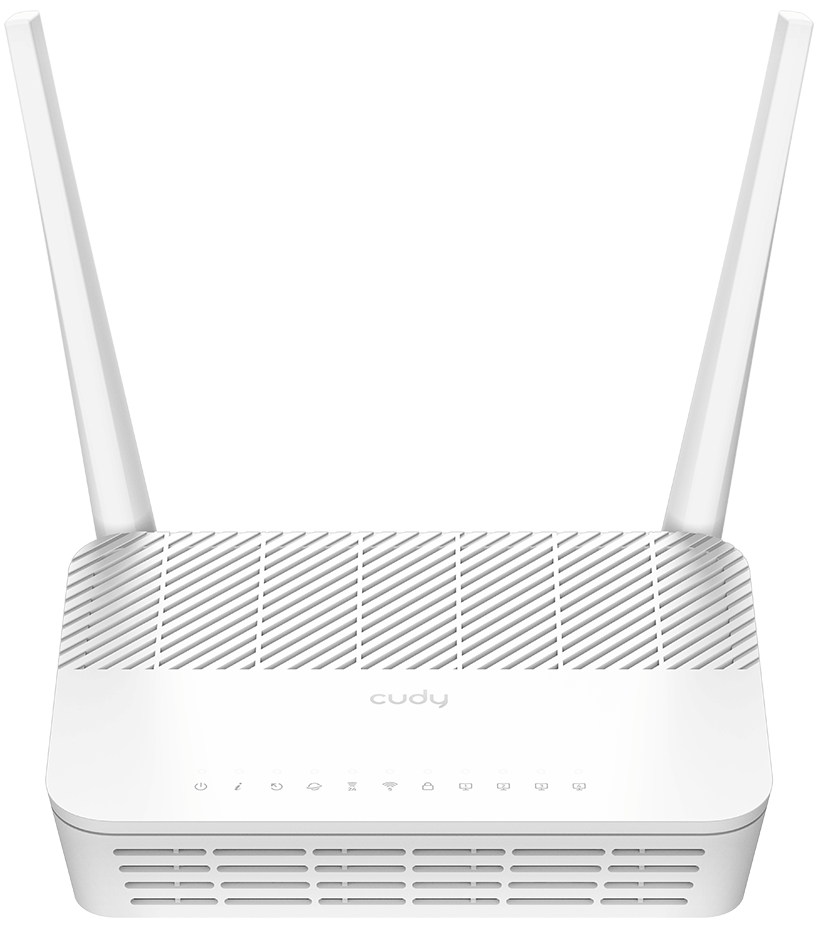
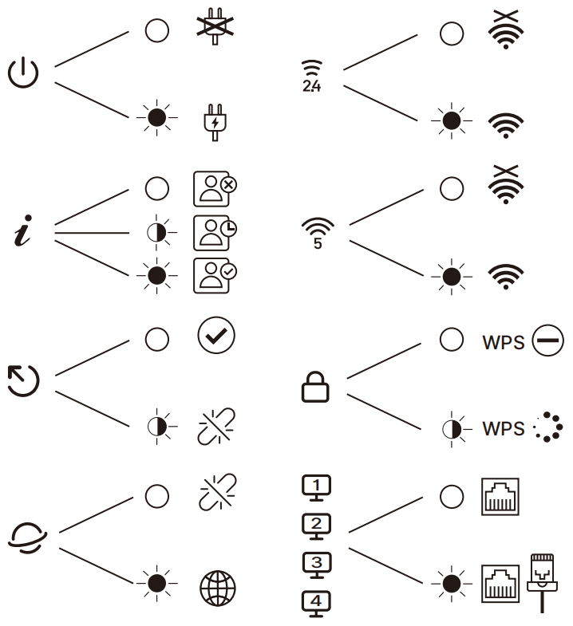
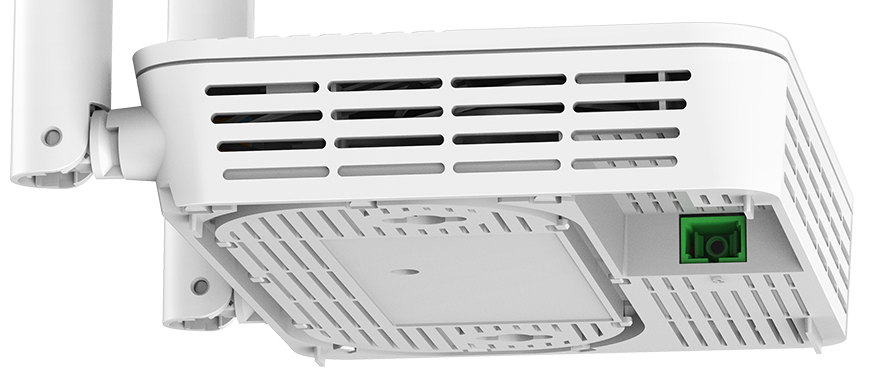
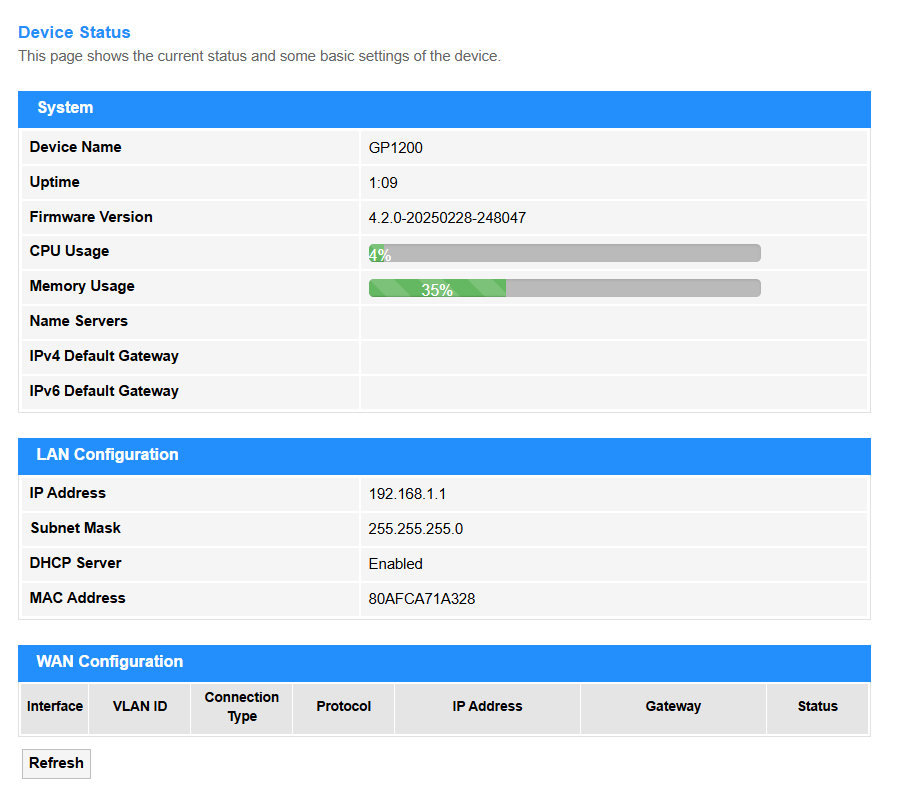
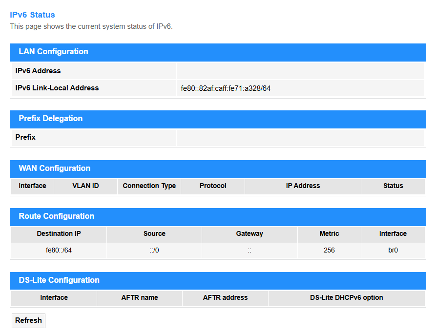
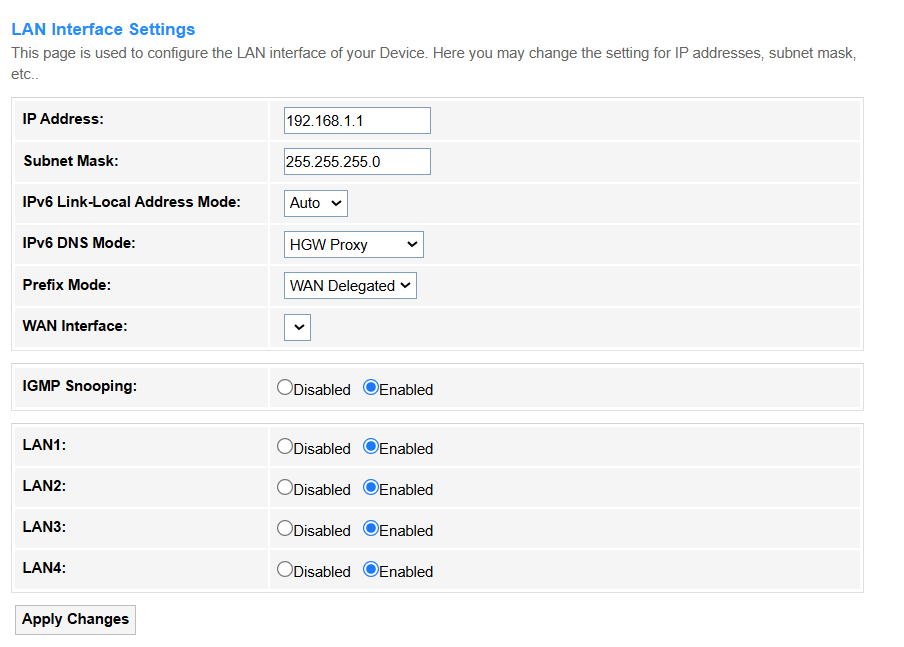

<a href="GP1200_User Guide.pdf" download>Download User Guide for GP1200 </a>

---
## Overview
<!DOCTYPE html>
<html lang="en">
<head>
    <meta charset="UTF-8">
    <meta name="viewport" content="width=device-width, initial-scale=1.0">
    <title>Tab切换示例</title>
    
</head>

<body>
    <!-- 标签容器 -->
    

        
Front Panel

        
Back Panel

        
Right Panel

        
Left Panel

        
Interface Description
    
    

    <!-- 内容面板容器 -->
    

        

            
 &nbsp;&nbsp;&nbsp;&nbsp;&nbsp;&nbsp;&nbsp;&nbsp;&nbsp; 

        

        

            

        

        

            

        

        

            

        

        

            
<!DOCTYPE html>
<head>

</head>
<body>
 
<table>
  <tr>
    <th>Interface</th>
    <th>Description</th>
  </tr>
  <tr>
    <td>ON/OFF Button</td>
    <td>Press to turn on/off the PON Router.</td>
  </tr>
  <tr>
    <td>Power Jack</td>
    <td>Plug the provided power adapter to supply power.</td>
  </tr>
  <tr>
    <td>LAN1/2/3 Port</td>
    <td>Connect to an Ethernet device.</td>
  </tr>
  <tr>
    <td>LAN4/WAN Port</td>
    <td>Connect to an Ethernet device or Internet. </td>
  </tr>
  <tr>
    <td>WPS Button</td>
    <td>Press for 1 seconds to authorize WPS connection.</td>
  </tr>
  <tr>
    <td>WLAN Button</td>
    <td> Press for 2 seconds to turn on/off Wi-Fi.</td>
  </tr>
  <tr>
    <td>RESET Button</td>
    <td>Press for 5 seconds to restore factory defaults.</td>
  </tr>
  <tr>
    <td>PON Port</td>
    <td>Connect to the Internet with an optical fiber.</td>
  </tr>
</table>

        

    

    
</body>
</html>

---
## Connection 

1. Connect the provided power adapter to the Power jack.
2. Connect the telephone to the LAN 1/2/3 port.
3. Connect the Internet to the PON port with an optical fiber.
4. Confirm the connection by checking LEDs: 
    - Power LED and PON LED: Solid on
    - LOS LED: Off
5. Connect your device via Wi-Fi or Ethernet cable.

 Wi-Fi name (SSID) and password are on the router's bottom label.

---

## Quick Setup

1. Launch a web browser on the device connected.
2. Enter *cudy.net* or *192.168.1.1* in the address bar.
3. Create an adminstrator password to log in.
4. Go to *WLAN* -> *Security* to configure the parameters, and click *Apply Changes*.
---

## Management

### [- Status](pon_status.md)

- **[Device](pon_status.md#device)** includes System, LAN Configuration, WAN Configuration. [>>>](pon_status.md#device)

- **[IPv6](pon_status.md#ipv6)** includes LAN Configuration, Prefix Delegation, WAN Configuration, Route Configuration and DS-Lite Configuration. [>>>](pon_status.md#ipv6)

- **[PON](pon_status.md#pon)** includes PON Status and GPON Status. [>>>](pon_status.md#pon)

- **[LAN Port](pon_status.md#lan-port)** includes status of LAN Port 1~4. [>>>](pon_status.md#lan-port)

- **[TR069](pon_status.md#tr069)** includes Inform Status and Connection from ACS. [>>>](pon_status.md#tr069)

[For more details about Status >>>](pon_status.md)

---
### [- LAN](pon_lan.md)

[For more details about LAN settings >>>](pon_lan.md)

---

### [- WLAN](pon_wlan.md)

#### [WLAN0(5GHz)](pon_wlan.md#wlan05ghz)
includes [Basic Settings](pon_wlan.md#basic-settings), [Advanced Settings](pon_wlan.md#advanced-settings), [Security](pon_wlan.md#security), [Access Control](pon_wlan.md#access-control), [Site Survey](pon_wlan.md#site-survey), [WPS](pon_wlan.md#wps), and [Status](pon_wlan.md#status).

#### [WLAN1(2.4GHz)](pon_wlan.md#wlan1-24ghz)
includes [Basic Settings](pon_wlan.md#wlan1-24ghz), [Advanced Settings](pon_wlan.md#wlan1-24ghz), [Security](pon_wlan.md#wlan1-24ghz), [Access Control](pon_wlan.md#wlan1-24ghz), [Site Survey](pon_wlan.md#wlan1-24ghz), [WPS](pon_wlan.md#wlan1-24ghz), and [Status](pon_wlan.md#wlan1-24ghz).

#### [Easy Mesh](pon_wlan.md#easy-mesh)
includes [EasyMesh Interface Setup](pon_wlan.md#easymesh-interface-setup) and [Topology](pon_wlan.md#topology).

---

### [- WAN](pon_wan.md)

[For more details about WAN settings >>>](pon_wan.md)

---

### - [Services](pon_service.md)

#### [Service](pon_service.md)

[**DHCP**](pon_service.md#dhcp) is to dynamically assigns IP addresses to devices on your local network for internet communication. [>>> >>>](pon_service.md#dhcp)

[**Dynamic DNS (DDNS)**](pon_service.md#dynamic-dns) supports automatically updating a domain name with your router's changing public IP address, allowing stable remote access. [>>> >>>](pon_service.md#dynamic-dns)

[**IGMP Proxy**](pon_service.md#igmp-proxy) relays multicast group membership information (like for IPTV streams) between your local network and the ISP network. [>>> >>>](pon_service.md#igmp-proxy) 

[**UPnP**](pon_service.md#upnp) allows compatible devices on your network (like games or media servers) to automatically configure router port forwarding rules for easier connectivity. [>>> >>>](pon_service.md#upnp)

[**RIP**](pon_service.md#rip) is a basic routing protocol where routers periodically share their entire routing tables to learn network paths (less common on home routers). [>>> >>>](pon_service.md#rip)

#### [Firewall](pon_service.md#ipport-filtering)

[**IP/Port Filtering**](pon_service.md#ipport-filtering) blocks or allows specific network traffic based on its source/destination IP address and/or port number. [>>> >>>](pon_service.md#ipport-filtering)

[**MAC Filtering**](pon_service.md#mac-filtering) restricts network access to only devices with specific, pre-approved hardware (MAC) addresses.  [>>> >>>](pon_service.md#mac-filtering)

[**Port Forwarding**](pon_service.md#port-forwarding) redirects incoming internet traffic on a specific port to a designated device/server within your private network. [>>> >>>](pon_service.md#port-forwarding)

[**URL Blocking**](pon_service.md#url-blocking) prevents access to specific websites based on their web address (URL) or keywords within the address. [>>> >>>](pon_service.md#url-blocking)

[**Domain Blocking**](pon_service.md#domain-blocking) prevents access to all websites belonging to a specific internet domain name. [>>> >>>](pon_service.md#domain-blocking)

[**DMZ**](pon_service.md#dmz) exposes one specific device on your network directly to the internet (bypassing most firewall protections) for hosting services, increasing security risks. [>>> >>>](pon_service.md#dmz)

---
### [- Advance](pon_advance.md)

[**GPON**](pon_advance.md#gpon-settings) (Gigabit Passive Optical Network) is to be established and managed the router connection to, including authentication (e.g., LOID/PPPoE), VLAN tagging, and bandwidth allocation for fiber-optic broadband services. [>>> >>>](pon_advance.md#gpon-settings) 

[**OMCI**](pon_advance.md#omci-information) short for ONU Management and Control Interface, is a protocol defined in the GPON standard. [>>> >>>](pon_advance.md#omci-information)

[**Remote Management**](pon_advance.md#remote-management) allows external access to router settings. [>>> >>>](pon_advance.md#remote-management)

[**Reboot**](pon_advance.md#reboot) the router to refresh its system, resolve temporary glitches, or apply critical updates, in cases like firmware updates, network instability, or scheduled maintenance. It may cause a brief network disconnection for about 1~3 minutes. [>>> >>>](pon_advance.md#reboot)

[**Multi-lingual Settings**](pon_advance.md#multi-lingual-settings) supports the web interface or app to display in multiple languages to improve accessibility for global users. [>>> >>>](pon_advance.md#multi-lingual-settings)

[**Backup/Restore**](pon_advance.md#backuprestore) supports saving the router's current configuration (e.g., Wi-Fi passwords, port rules) to a file for backup, and later restoring it to recover settings after a reset. [>>> >>>](pon_advance.md#backuprestore)

[**System Log**](pon_advance.md#system-log) records all critical router events (e.g., connections, errors, attacks) for troubleshooting and security monitoring. [>>> >>>](pon_advance.md#system-log)

[**Password**](pon_advance.md#password) is the authentication credential (letters/numbers/symbols) required to access the router's admin interface, thus to prevent unauthorized changes. [>>> >>>](pon_advance.md#password)

[**Firmware Upgrade**](pon_advance.md#firmware-upgrade) updates the router's operating system to patch vulnerabilities or add features (requires stable power/internet). [>>> >>>](pon_advance.md#firmware-upgrade)

[**Time Zone**](pon_advance.md#time-zone) configuration sets local time for accurate logs/schedules (e.g., parental controls). [>>> >>>](pon_advance.md#time-zone)

[**TR-069**](pon_advance.md#tr-069) configuration enables remote ISP management (auto-configuration/troubleshooting).[>>> >>>](pon_advance.md#tr-069)

[**Logout**](pon_advance.md#logout) is to securely exit the admin interface to prevent unauthorized access. [>>> >>>](pon_advance.md#logout)

---

### [- Diagnostics](pon_diagnostics.md)

[**Ping**](pon_diagnostics.md#ping) is a network tool that sends ICMP echo requests to test if a device (e.g., server, router) is reachable and measure response time. It’s used to verify connectivity, detect latency, or troubleshoot network failures. [>>> >>>](pon_diagnostics.md#ping)

[**Ping6** ](pon_diagnostics.md#ping6) is an IPv6 version of the ping tool that sends ICMPv6 Echo Requests to test connectivity and measure latency between devices in an IPv6 network. It's primarily used to verify IPv6 reachability, troubleshoot network issues, and assess path performance. [>>> >>>](pon_diagnostics.md#ping6) 

[**Tracert (Traceroute)**](pon_diagnostics.md#tracert) is a network diagnostic tool that maps the path (hops) between your router and a target IP/domain, measuring latency at each node. It's used to identify routing failures, congestion points, or connectivity issues across networks. [>>> >>>](pon_diagnostics.md#tracert)

[**Tracert6** ](pon_diagnostics.md#tracert6) is the IPv6 version of traceroute, mapping the network path (hops) to a target IPv6 address using ICMPv6 probes. It's used to diagnose routing issues, latency problems, or connectivity failures in IPv6 networks. [>>> >>>](pon_diagnostics.md#tracert6)

---

### [- Statistics](pon_statistics.md)

[**Interface Statistics**](pon_statistics.md)
monitors real-time traffic data (e.g., speed, packets, errors) on router interfaces (WAN/LAN) and thus help to troubleshoot network performance or congestion. [>>> >>>](pon_statistics.md)

[**PON Statistics**](pon_statistics.md#pon-statistics)
tracks optical signal metrics (e.g., power levels, uptime) for fiber connections (GPON/EPON), and thus to ensure stable ISP link quality. Only visible on fiber-optic routers with PON ports. [>>> >>>](pon_statistics.md#pon-statistics)

---