# Advance

## GPON Settings

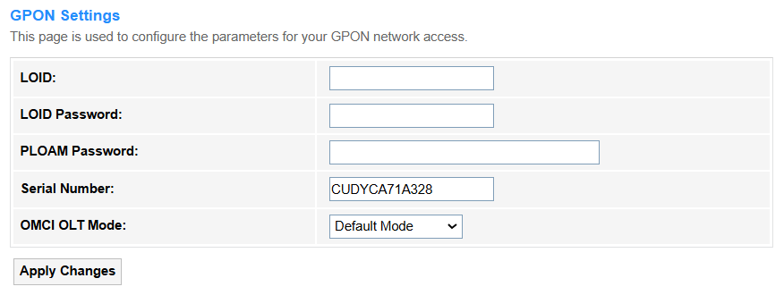

<strong>GPON</strong> (Gigabit Passive Optical Network) is to be established and managed the router connection to, including authentication (e.g., LOID/PPPoE), VLAN tagging, and bandwidth allocation for fiber-optic broadband services.

<strong>• LOID:</strong> Enter the unique identifier (Logical ONU ID) assigned by your ISP for GPON authentication.

<strong>• LOID Password:</strong> Enter an optional security credential paired with LOID for enhanced authentication (if required by ISP).

<strong>• PLOAM Password:</strong> Enter the Encryption key used in GPON's physical layer authentication (typically pre-configured by ISP).

<strong>• Serial Number:</strong> Input the ONT's hardware identifier (SN/MAC), sometimes used as backup authentication.

<strong>• OMCI OLT Mode:</strong> Select a management protocol compatibility.

   
    - Default Mode: Uses standard OMCI protocol for basic ONU management, compatible with most OLTs.
    - Huawei OLT Mode: Optimized for Huawei OLTs, supporting vendor-specific extensions like enhanced VoIP/SLA features.
    - ZTE OLT Mode: Tailored for ZTE OLTs, enabling proprietary functions such as advanced diagnostics.
    - Customized Mode: Allows manual configuration of OMCI parameters for non-standard OLT/ONU scenarios.

• Apply Changes: Click to activate all the settings or changes.

---

## OMCI Information
    
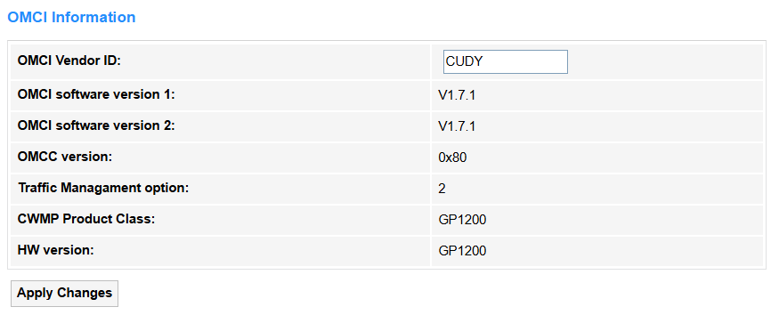

<strong>• OMCI Vendor ID:</strong> Identifies the manufacturer of the ONU device. Typically follows IEEE standards but can be modified for proprietary network integrations.

<strong>• OMCI Software Version 1/2:</strong> Displays the primary/secondary firmware versions running on the ONU.

<strong>• OMCI Version:</strong> Specifies the OMCI protocol standard supported.

<strong>• Traffic Management Option:</strong> Indicates QoS/bandwidth control capabilities.

<strong>• CWMP Product Class:</strong> Defines the device model for TR-069 auto-configuration.

<strong>• HW Version:</strong> Shows the hardware revision of the ONU.

• Apply Changes: Click to activate all the settings or changes.

---

## Remote Management

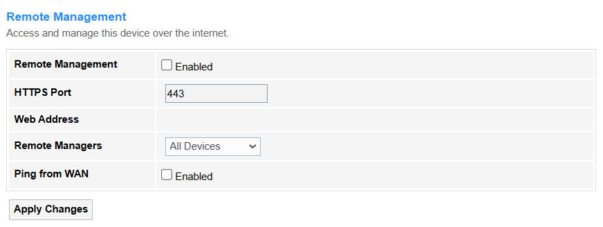

<strong>• Enable:</strong> Tick to turn on/off remote management, to allow external access to router settings.

<strong>• HTTPS Port:</strong> Specifies the secure port (e.g., 443) for encrypted remote access.

<strong>• Web Address:</strong> The URL or public IP used to access the router externally.

<strong>• Remote Managers:</strong> Select *Specified Device* (with its IP Address) or *All Devices* to allow connection and management.

<strong>• Ping from WAN:</strong> If enabled, external devices will be allowed to ping the router’s WAN IP (useful for testing but risky).

• Apply Changes: Click to activate all the settings or changes.

## Reboot

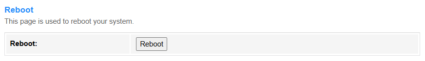

<strong>Reboot</strong> the router to refresh its system, resolve temporary glitches, or apply critical updates, in cases like firmware updates, network instability, or scheduled maintenance. It may cause a brief network disconnection for about 1~3 minutes.

• Reboot: Click to start rebooting. When it is finished, you will be popped up to log in again.

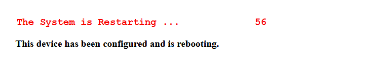

---

## Multi-lingual Settings

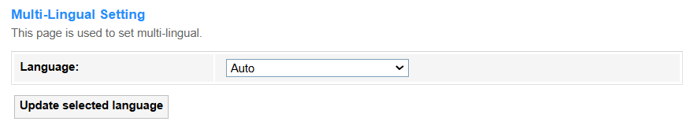

<strong>Multi-lingual Settings</strong> supports the web interface or app to display in multiple languages (e.g., English/中文) to improve accessibility for global users.

- Auto: Select to allow the router to automatically detect the system language and display.
- Other Language: Select your target language and click *Update selected* language to change the display language.

---

## Backup/Restore

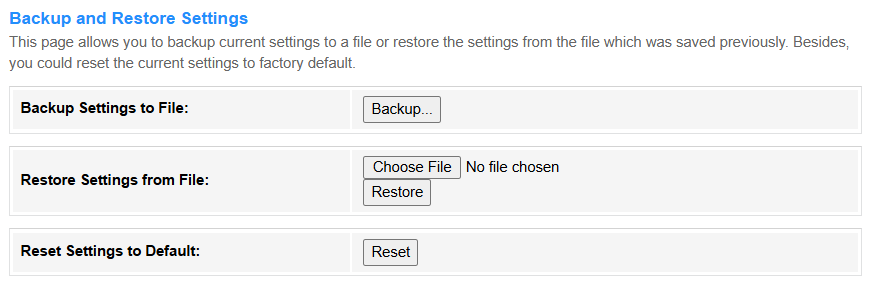

<strong>Backup/Restore</strong> supports saving the router's current configuration (e.g., Wi-Fi passwords, port rules) to a file for backup, and later restoring it to recover settings after a reset.

<strong>• Backup Settings to File:</strong> Click <i>Backup...</i> to download the current settings in a <i>config.xml</i> file.

<strong>• Restore Settings from File:</strong> Click <i>Choose File</i> to upload the <i>config.xml</i> file and then click <i>Restore</i> to update the settings.

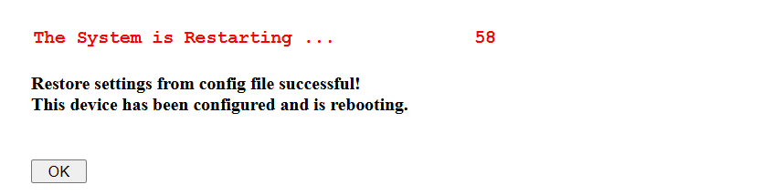

<strong>• Reset Settings to Default:</strong> Click <i>Reset</i> to restore the factory default settings.

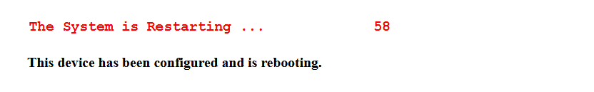

---

## System Log

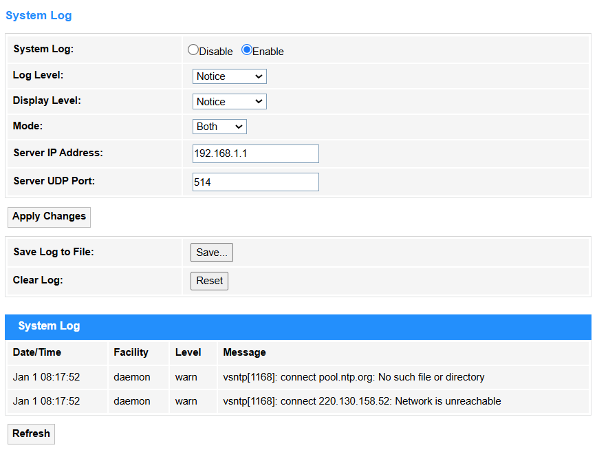

<strong>System Log</strong> records all critical router events (e.g., connections, errors, attacks) for troubleshooting and security monitoring.

<strong>• System Log:</strong> Select <i>Enable</i> to turn on the system log configuration.

<strong>• Log Level:</strong> Define severity filtering to control which events are recorded.

<strong>• Display Level:</strong> Set the minimum severity level shown in the router's log interface.

<strong>• Mode:</strong> Choose log storage and retention rule.

<strong>• Server IP Address:</strong> Enter the destination for remote syslog (e.g., 192.168.1.100) when using external logging.

<strong>• Server UDP Port:</strong> Specify the port (default:514) for syslog server communication.

• Apply Changes: Click to activate all the settings or changes.

• Save Log to File: Click <i>Save...</i> to save the system logs into a file.

• Clear Log: Click <i>Reset</i> to clear the system log recorded.

• Refresh: Click to update the System Log.

---

## Password

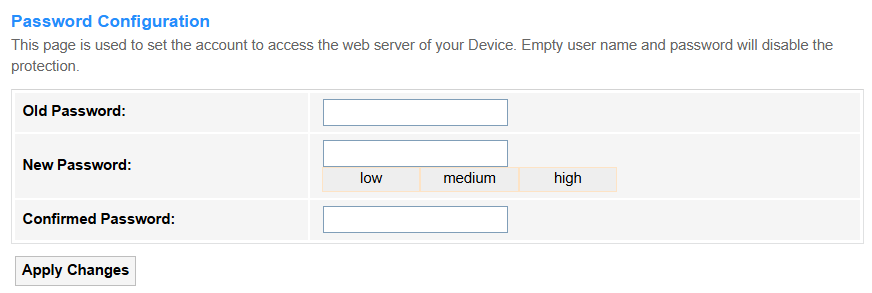

<strong>Password</strong> is the authentication credential (letters/numbers/symbols) required to access the router's admin interface, thus to prevent unauthorized changes.

<strong>• Old Password:</strong> Enter the current active password required for verification before changing to a new one.

<strong>• New Password:</strong> Enter a new credential to replace the old password, with strength indicators Low/Medium/High to rate complexity (length/symbols) thus preventing weak passwords.

<strong>• Confirmed Password:</strong> Re-entered the new password to ensure typing accuracy and avoid lockouts.

• Apply Changes: Click to activate all the settings or changes.

---

## Firmware Upgrade

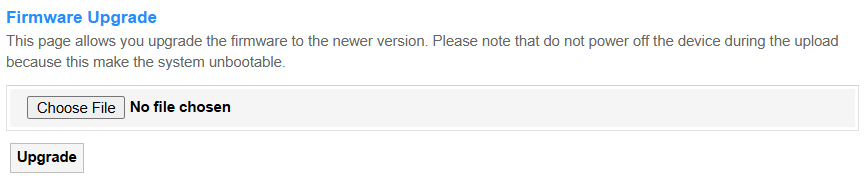

<strong>Firmware Upgrade</strong> updates the router's operating system to patch vulnerabilities or add features (requires stable power/internet).

• Choose File: Click to locate and upload the firmware file (e.g., GP1200-xxxxxx.bin) to be upgraded.

• Upgrade: Click to start upgrade process.

---

## Time Zone

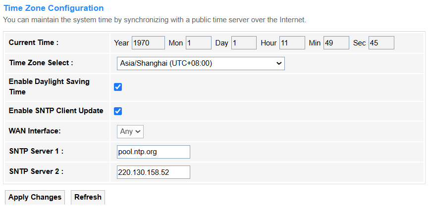

<strong>Time Zone</strong> configuration sets local time for accurate logs/schedules (e.g., parental controls).

<strong>• Current Time:</strong> Displays the router's current local time based on configured time zone and daylight saving settings.

<strong>• Time Zone Select:</strong> Select the geographic time zone (e.g., UTC+8) to synchronize the router's clock.

<strong>• Enable Daylight Saving Time:</strong> Tick to enable automatically adjusting the clock forward/backward for daylight saving periods.

<strong>• Enable SNTP Client Update:</strong> Tick to enable the router syncs time with an external SNTP (Simple Network Time Protocol) server.

<strong>• WAN Interface:</strong> Select to specify which internet-facing network interface (e.g., PPPoE) is used for SNTP time updates.

<strong>• SNTP Server 1/2:</strong> Enter the primary and backup server addresses (e.g., pool.ntp.org) for fetching accurate time data.

• Apply Changes: Click to activate all the settings or changes.

• Refresh: Click to update the Time Zone.

---

## TR-069

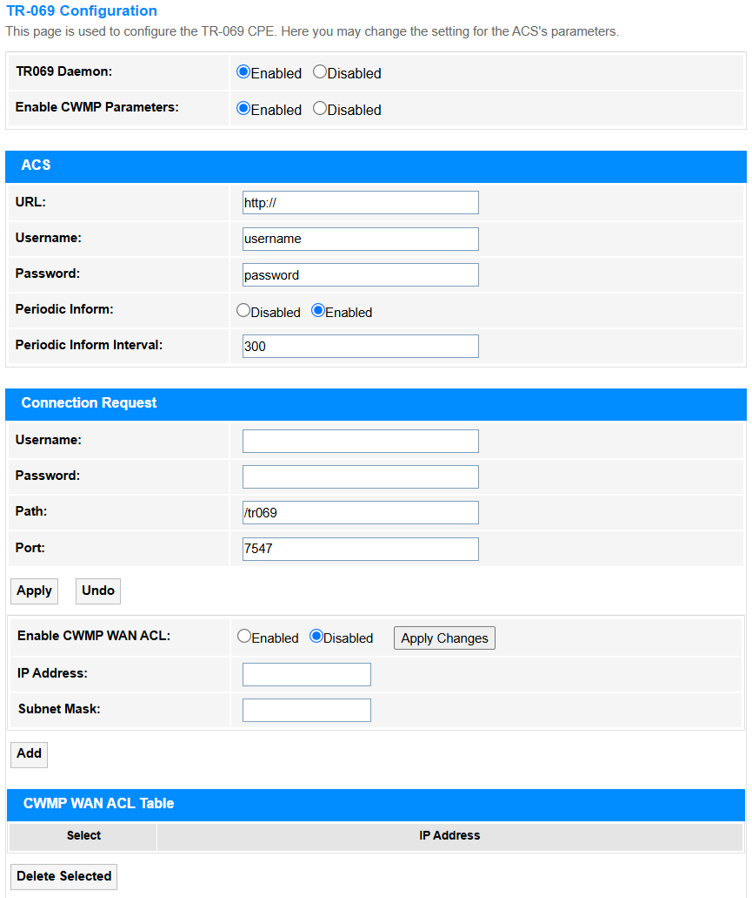

<strong>TR-069</strong> configuration enables remote ISP management (auto-configuration/troubleshooting).

<strong>• TR069 Daemon:</strong> Select to enable TR069 Daemon which is the background service that manages TR-069 (CWMP) protocol for remote router configuration and monitoring by the ISP.

<strong>• Enable CWMP Parameters:</strong> Select to enable the router to comply with the TR-069 (CWMP) protocol, permitting remote management, configuration, and updates by the ISP's Auto-Configuration Server (ACS).

<strong>- ACS</strong>

   
• URL:Enter the ISP's Auto-Configuration Server (ACS) address for remote management.

• Username/Password: Enter the credentials for authenticating the router with the ISP's ACS server.

• Periodic Inform (Interval): Select to enable and enter the interval when the router sends regular status updates to the ACS.

<strong>- Connection Request</strong>

• Username/Password: Enter the credentials used by the ACS to initiate a reverse connection to the router.

• Path/Port: Enter the endpoint path (e.g., /tr069) and port (e.g., 7547) for ACS communication.

• Enable CWMP WAN ACL: Select to enable and restrict TR-069 (CWMP) remote management access only to specified IP ranges, thus enhancing security by blocking unauthorized WAN connections.

• IP Address: Specifies the starting WAN IP address (e.g., 203.0.113.10) permitted for TR-069 (CWMP) remote management, ensuring only authorized ISP servers can access the router.

• Subnet Mask: Defines the network range (e.g., 255.255.255.0 or /24) for the allowed IP addresses, controlling how many devices in the same subnet can establish TR-069 connections.

<strong>• CWMP WAN ACL Table:</strong> Lists allowed IP ranges for ACS access, enhancing security against unauthorized control.

• Apply: Click to activate all the settings or changes.

• Undo: Click the undo the changes before applying.

• Apply Changes: Click to activate all the settings or changes.

• Add: Click to add the configured entry into the table below.

• Delete Selected: Click to delete the selected entries in the <i>CWMP WAN ACL Table</i>.

---

## Logout

<strong>Logout</strong> is to securely exit the admin interface to prevent unauthorized access.

• Logout: Click to log out the administration webpage.

---
