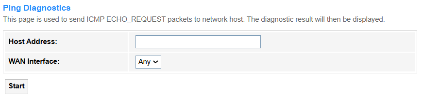
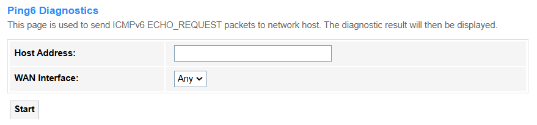
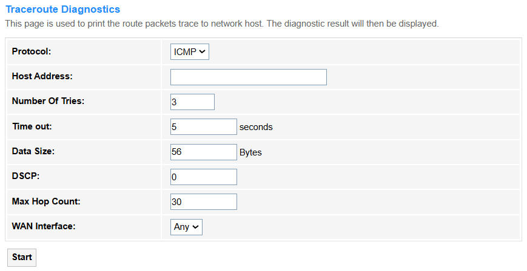
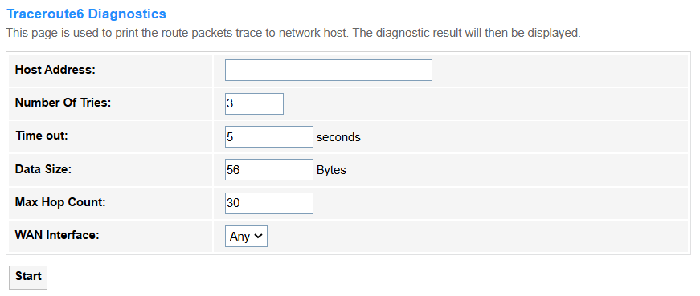

# Diagnostics

## Ping

<strong>Ping</strong> is a network tool that sends ICMP echo requests to test if a device (e.g., server, router) is reachable and measure response time. It’s used to verify connectivity, detect latency, or troubleshoot network failures.

<strong>• Host Address:</strong> Enter the target IP/domain you want to test (e.g., 8.8.8.8 or google.com).

<strong>• WAN Interface:</strong> Keep the default *Any* and the router will automatically use its primary WAN IP (or all available WAN interfaces) as the source for the ping test.

• Start: Click to run the diagnostics.

---

## Ping6

  

<strong>Ping6</strong> is an IPv6 version of the ping tool that sends ICMPv6 Echo Requests to test connectivity and measure latency between devices in an IPv6 network. It's primarily used to verify IPv6 reachability, troubleshoot network issues, and assess path performance.

<strong>• Host Address:</strong> Enter the target IPv6 address (e.g., 2001:db8::1) or domain name to test connectivity.

<strong>• WAN Interface:</strong> The router's IPv6-enabled public-facing interface (or "Any" for auto-selection), determining the source of Ping6 packets.

<strong>• WAN Interface:</strong> Keep the default *Any* and the router will automatically select an active IPv6-enabled WAN interface as the Ping6 source.

• Start: Click to run the diagnostics.

---

## Tracert

<strong>Tracert (Traceroute)</strong> is a network diagnostic tool that maps the path (hops) between your router and a target IP/domain, measuring latency at each node. It's used to identify routing failures, congestion points, or connectivity issues across networks.

<strong>• Protocol:</strong> Select a proper protocol for the traceroute test.

<blockquote>

<strong>- ICMP</strong> (Internet Control Message Protocol) is a Layer-3 protocol used for diagnostics (e.g., ping, traceroute) and error reporting (e.g., "Destination Unreachable").

<strong>- UDP</strong> (User Datagram Protocol) is a Layer-4 protocol for fast, connectionless data transmission (e.g., video streaming, DNS queries).
</blockquote>

<strong>• Host Address:</strong> Enter the target IP or domain name to trace the network path to.

<strong>• Number Of Tries:</strong> Sets how many probe packets are sent per hop (default 3).

<strong>• Time out:</strong> Defines how long (seconds) to wait for a hop's response before marking it as failed.

<strong>• Data Size:</strong> Adjusts the probe packet size (bytes) to test MTU/fragmentation issues.

<strong>• DSCP:</strong> Marks packets with a QoS priority value (0-63) for traffic prioritization testing.

<strong>• Max Hop Count:</strong> Limits the maximum hops traced (default 30) before stopping.

<strong>• WAN Interface:</strong> Keep the default *Any* and the router will automatically choose the optimal WAN interface (based on routing tables) as the source for outgoing traceroute packets.

• Start: Click to run the diagnostics.

---

## Tracert6

<strong>Tracert6</strong> is the IPv6 version of traceroute, mapping the network path (hops) to a target IPv6 address using ICMPv6 probes. It's used to diagnose routing issues, latency problems, or connectivity failures in IPv6 networks.

<strong>• Host Address:</strong> Enter the target IPv6 address (e.g., 2001:db8::1) or domain name to trace the network path to.

<strong>• Number Of Tries:</strong> Sets how many ICMPv6 probe packets are sent per hop (default typically 3).

<strong>• Time out:</strong> Defines the wait time (in seconds) for each hop's response before marking it as failed.

<strong>• Data Size:</strong> Adjusts the ICMPv6 probe packet size (bytes) to test path MTU or fragmentation.

<strong>• Max Hop Count:</strong> Limits the maximum number of hops traced (default 30) before stopping.

<strong>• WAN Interface:</strong> Keep the default *Any* and the router will automatically select an active IPv6-enabled WAN interface as the source for outgoing traceroute probes, following the system's default IPv6 routing table.

• Start: Click to run the diagnostics.

---