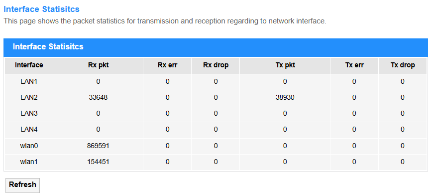
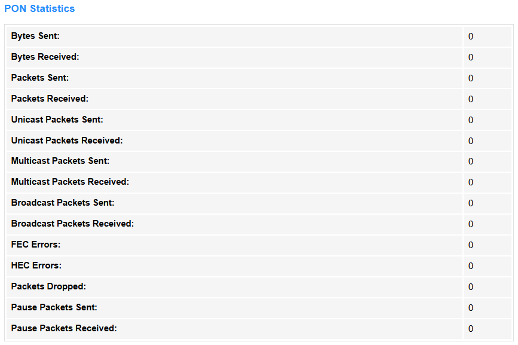

# Statistics

## Interface

    

<strong>Interface Statistics</strong> monitors real-time traffic data (e.g., speed, packets, errors) on router interfaces (WAN/LAN) and thus help to troubleshoot network performance or congestion.

    

<strong>• Interface:</strong> The network port name (e.g., WAN/LAN) being monitored.

<strong>• Rx pkt:</strong> Total packets received (inbound traffic).

<strong>• Rx err:</strong> Corrupted/error packets received (CRC/alignment issues).

<strong>• Rx drop:</strong> Packets dropped due to buffer/bandwidth limits.

<strong>• Tx pkt:</strong> Total packets transmitted (outbound traffic).

<strong>• Tx err:</strong> Failed transmissions (collisions/queue errors).

<strong>• Tx drop:</strong> Packets discarded before sending (congestion/QoS rules).

• Refresh: Click to update the Interface Statistics.

----

## PON_Statistics

<strong>PON Statistics</strong> tracks optical signal metrics (e.g., power levels, uptime) for fiber connections (GPON/EPON), and thus to ensure stable ISP link quality. Only visible on fiber-optic routers with PON ports.

<strong>• Bytes Sent/Received:</strong> Total data volume (in bytes) sent or received over the PON interface.

<strong>• Packets Sent/Received:</strong> Count of all packets (including unicast/multicast/broadcast) sent or received.

<strong>• Unicast Packets Sent/Received:</strong> Point-to-point traffic (single destination) sent or received.

<strong>• Multicast Packets Sent/Received:</strong> Traffic sent to or received from a specific group of devices.

<strong>• Broadcast Packets Sent/Received:</strong> Traffic sent to or received from all devices in the network.

<strong>• FEC Errors:</strong> Forward Error Correction errors, indicating signal quality issues.

<strong>• HEC Errors:</strong> Header Error Control errors, indicating signal quality issues.

<strong>• Packets Dropped:</strong> Packets discarded due to congestion/buffer limits.

<strong>• Pause Packets Sent/Received:</strong> Flow control frames sent or received to temporarily halt data transmission during network congestion, preventing packet loss.
