# WLAN

## WLAN0(5GHz)

### Basic Settings

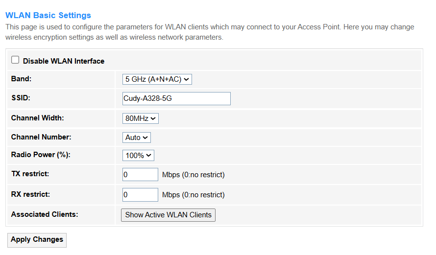

- Disable WLAN Interface: Once ticked, all the relevant WLAN settings, like *Band, *SSID*, *WLAN Clients*, *Security*, *Access Control*, *Site survey*, *WPS* will be locked and unable to configure.

- Band: Radio frequency range and protocol standards the router uses to transmit Wi-Fi signals.

        - 5 GHz (A): 802.11a mode (54Mbps max).
        - 5 GHz (N): 802.11n (300-450Mbps).
        - 5 GHz (A+N): 802.11a and 802.11n.
        - 5 GHz (AC): 802.11ac (Wi-Fi 5, up to 1.3Gbps).
        - 5 GHz (N+AC): 802.11n and 802.11ac together.
        - 5 GHz (A+N+AC): 802.11a/n/ac modes. 

- SSID: Displays the default wireless network name. You may customize it as desired.

- Channel Width: Frequency space the Wi-Fi signal occupies, directly impacting speed and interference.

- 20MHz: Deliver ~100Mbps per stream, ideal for crowded areas to minimize interference.

- 40MHz: Deliver ~200Mbps speeds, offering a balance between performance and interference risk in moderate-density environments.

- 80MHz: Deliver 400-600Mbps speeds, ideal for high-bandwidth applications like 4K streaming, but requires clean 5GHz spectrum to avoid interference.

- Channel Number: Specifies the exact frequency your Wi-Fi uses within the 5GHz band.

        - 36: Lowest frequency at 5180MHz with best range.
        - 40: Frequency at 5200MHz with slightly higher speed.
        - 44: Frequency at 5220MHz with medium performance.
        - 48: Frequency at 5240MHz with higher speed and shorter range.
 
- Radio Power: Signal transmission strength of the router's Wi-Fi antenna. It controls how far your wireless signal reaches.

        - 100%: Maximum signal strength for large spaces, but risks interference in dense areas.
        - 70%: Balanced coverage for medium-sized homes with minimal neighbor disruption.
        - 50%: Optimized for apartments to reduce interference while maintaining decent range.
        - 35%: Limits coverage to small rooms, ideal for minimizing network congestion.
        - 15%: Ultra-low power for testing or ultra-dense environments (e.g., offices with many APs).

- TX Restrict: Blocks outbound data to specific devices (e.g., throttling a bandwidth-hogging device).
- RX Restrict: Blocks inbound data from devices (e.g., preventing unauthorized access).
- Associated Clients: Devices currently connected to the Wi-Fi network.
- Apply Changes: Click to activate all the settings or changes.
- Show Active WLAN Clients: Click to view the client list.
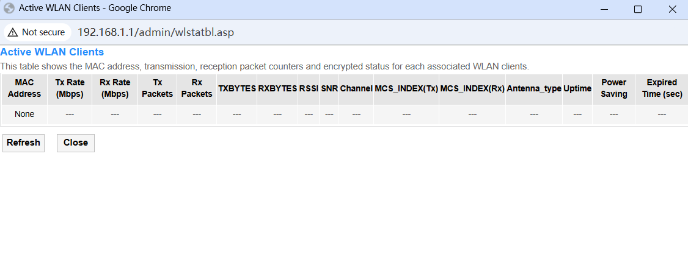

---

### Advanced Settings

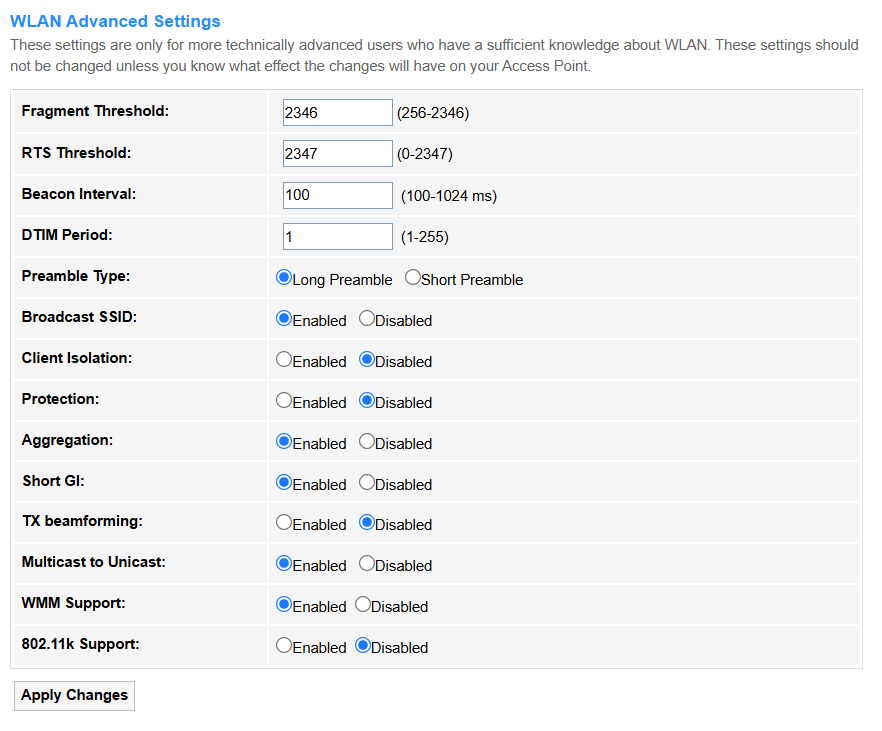

- Fragment Threshold: Maximum packet size (in bytes) before splitting data into smaller fragments, ranging from 256-2346. Keep it as default unless necessary.
- RTS Threshold: Minimum packet size to trigger RTS/CTS handshake in order to reduce collisions, ranging from 0-2347. Keep it as default unless necessary.
- Beacon Interval: Time interval (ms) between Wi-Fi beacon signals broadcast by the router, ranging from 100-1024 ms.
- DTIM Period: Frequency at which buffered multicast data is announced to sleeping devices, ranging from 1-255.
- Preamble Type: Short/Long header format for compatibility (e.g., legacy devices). Select as needed.
- Broadcast SSID: Enable or Disable the wireless network name to be visible.
- Client Isolation: Enable to block direct communication between connected devices for security, otherwise Disable it.
- Protection: Legacy mode (e.g., 802.11b/g) to prevent interference with older devices. Enable or Disable it as needed.
- Aggregation: Combines small packets for faster throughput (e.g., A-MPDU in 802.11n/ac). Enable or Disable it as needed.
- Short GI: Short Guard Interval reduces transmission delays for higher speeds. Enable or Disable it as needed.
- TX Beamforming: Focuses Wi-Fi signals toward clients to improve range/performance. Enable or Disable it as needed.
- Multicast to Unicast: Converts multicast traffic (e.g., streaming) to unicast for reliability. Enable or Disable it as needed.
- WMM Support: QoS prioritization for voice/video traffic (e.g., VoIP, Zoom). Enable or Disable it as needed.
- 802.11k Support: Helps devices roam efficiently by reporting nearby APs. Enable or Disable it as needed.
- Apply Changes: Click to activate all the settings or changes.

---

### Security

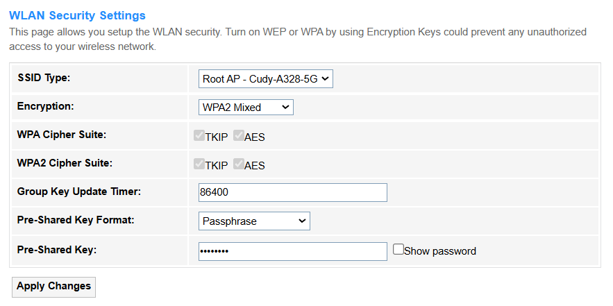

- SSID Type: Shows the Router's network name (SSID) broadcasted. Root AP-Cudy-xxxxxx is the default setting.
- Encryption: Security protocol to scramble data over Wi-Fi.
      
        - None: No encryption; data is transmitted openly (highly insecure).
        - WEP: Outdated encryption using weak RC4 cipher (easily hacked). Only 11A,11B,11G and 11BG band support it.
        - WPA2: Modern AES-based encryption (secure but vulnerable to KRACK attacks). Keep Authentication Mode/IEEE 802.11w/SHA256/WPA2 Cipher Suite/Group Key Update Timer as default, and configure the Pre-Shared Key Format and Pre-Shared Key as desired.
        - WPA2 Mixed: Supports both WPA2 (AES) and legacy WPA (TKIP) for compatibility. Keep WPA Cipher Suite/WPA2 Cipher Suite/Group Key Update Timer as default, and configure the Pre-Shared Key Format and Pre-Shared Key as desired.
        - WPA3: Latest standard with stronger AES-GCMP and forward secrecy (most secure). Keep H2E/IEEE 802.11w/Cipher Suite/Group Key Update Timer as default, and set up the Pre-Shared Key as desired.
        - WPA3 Transition: Hybrid mode (WPA3 + WPA2) for gradual device upgrades. Keep H2E/IEEE 802.11w/SHA256/Cipher Suite/Group Key Update Timer as default, and set up the Pre-Shared Key as desired.

- Apply Changes: Click to activate all the settings or changes.

---

### Access Control

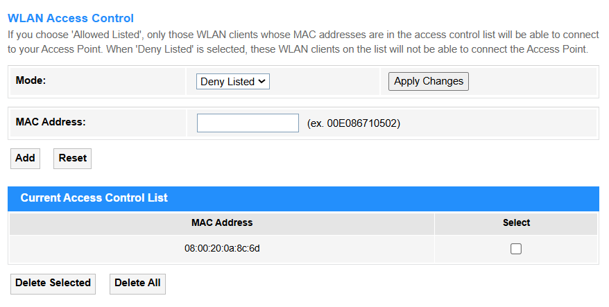

- Mode: Devices are allowed or blocked from connecting to the wireless network.

        - Disabled: Access Control is disabled.
        - Allow Listed: Only the WLAN clients whose MAC addresses are in the Access Control list are allowed to connect to the Access Point.
        - Deny Listed: Only those WLAN clients whose MAC addresses are in the access control list will not be able to connect to your Access Point.

- MAC Address: The unique hardware identifier assigned to a device's network interface (e.g., Wi-Fi or Ethernet) for communication on a local network.
- Apply Changes: Click to activate all the settings or changes.
- Add: Click to add new entries into the Current Access Control List.
- Reset: Click to clear the MAC Address filled in the blank.
- Select: Select the MAC address in the list.
- Delete Selected: Click to delete the selected MAC address in the list.
- Delete All: Click to delete all the MAC address in the list.

---

### Site Survey

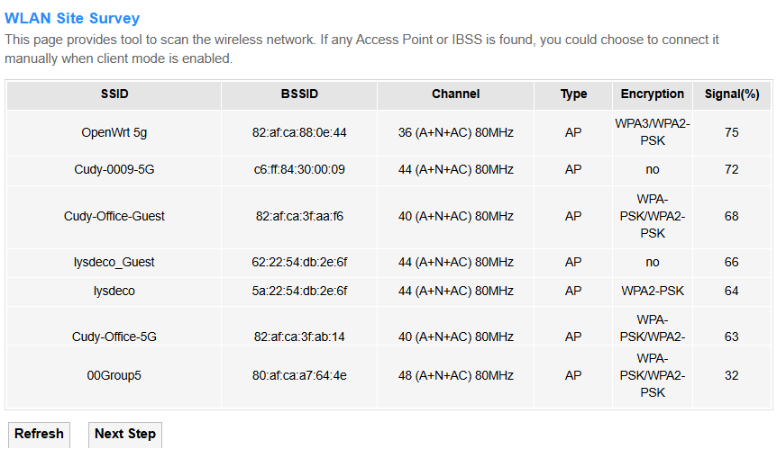

The list will display these network's SSID/BSSID/Wireless Channel opened/Network Type/Encryption/Signal Strength. You may choose to connect the target network manually when client mode is enabled.

- Refresh: Click to update the list of nearby networks available.

---

### WPS

- Disable WPS: WPS is enabled by default. Tick it if you want to disable the WPS function.
- WPS Status: Configured by default.
- Auto-lock-down state: Unlocked by default.
- Self-PIN Number: Displays the current PIN number (an 8-digit numeric code used to securely connect devices to a Wi-Fi network via the Wi-Fi Protected Setup protocol).
- Regenerate PIN: Click to get a new PIN number.
- Reset: Click to retrieve the previous PIN number.
- Apply Changes: Click to activate the settings and changes.
- Push Button: Click this virtual button <i>Start PBC</i> to quickly and easily start the WPS process. Then you have to run WPS in the client(s) within 2 minutes.
- Client PIN number: Enter the client's PIN number and then click <i>Start PIN</i> to connect it to the router's wireless network.

---

### Status

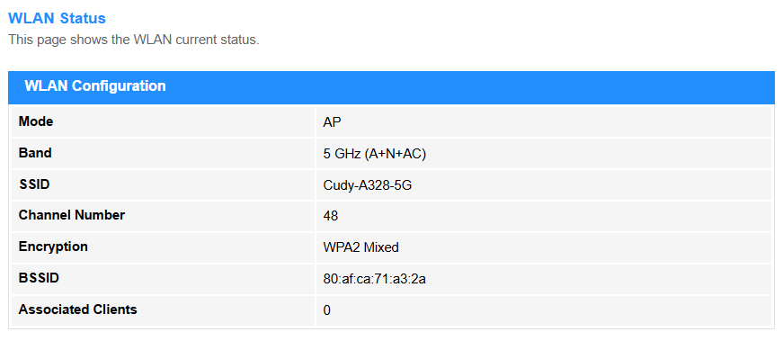

This page will display the current 5G WLAN Status, including Mode, Band, SSID, Channel Number, Encryption, BSSID and Associated Clients.

----

## WLAN1 (2.4GHz)

### Basic Settings

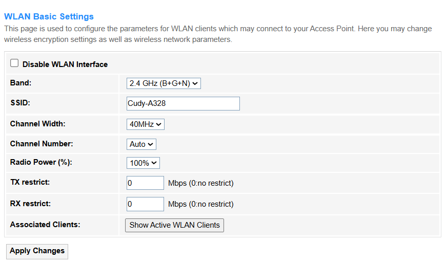

- Disable WLAN Interface: Once ticked, all the relevant WLAN settings, like *Band*, *SSID*, *WLAN Clients*, *Security*, *Access Control*, *Site survey*, *WPS* will be locked and unable to configure.
- Band: Radio frequency range and protocol standards the router uses to transmit Wi-Fi signals.

        - 2.4 GHz (B): 802.11b mode (11Mbps max)
        - 2.4 GHz (G): 802.11g mode (54Mbps max)
        - 2.4 GHz (B+G): 802.11b and 802.11g mixed mode
        - 2.4 GHz (N): 802.11n mode (Wi-Fi 4, up to 600Mbps)
        - 2.4 GHz (G+N): 802.11g and 802.11n mixed mode
        - 2.4 GHz (B+G+N): 802.11b/g/n mixed modes

- SSID: Displays the default wireless network name. You may customize it as desired.
- Channel Width: Frequency space the Wi-Fi signal occupies, directly impacting speed and interference.

        - 20MHz: Deliver ~72Mbps reliably using 3 clean channels (1/6/11), best for IoT devices.
        - 40MHz: Deliver ~150Mbps but suffers severe interference, making it impractical for most environments.

- Channel Number: Specifies the exact frequency the Wi-Fi uses within the 2.4GHz band.
        - For Stability: Lock to Channel 1/6/11 (20MHz).
        - For IoT Devices: Prioritize Channel 1 (least Bluetooth interference).
- Avoid Auto if neighbors’ Wi-Fis exceed 15+ detectable networks.
- Radio Power: Signal transmission strength of the router's Wi-Fi antenna. It controls how far your wireless signal reaches.

        - 100%: Maximum signal strength for large spaces, but risks interference in dense areas.
        - 70%: Balanced coverage for medium-sized homes with minimal neighbor disruption.
        - 50%: Optimized for apartments to reduce interference while maintaining decent range.
        - 35%: Limits coverage to small rooms, ideal for minimizing network congestion.
        - 15%: Ultra-low power for testing or ultra-dense environments (e.g., offices with many APs).

- TX Restrict: Blocks outbound data to specific devices (e.g., throttling a bandwidth-hogging device).
- RX Restrict: Blocks inbound data from devices (e.g., preventing unauthorized access).
- Associated Clients: Devices currently connected to the Wi-Fi network.
- Show Active WLAN Clients: Click to view the client list.
- Apply Changes: Click to activate all the settings or changes.

### Advanced Settings

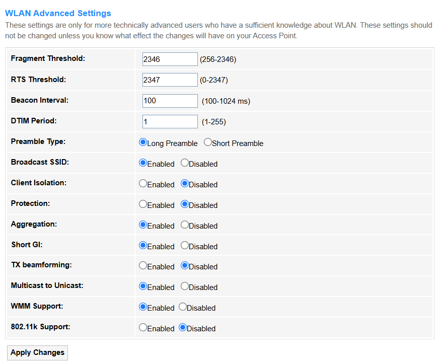

- Fragment Threshold: Maximum packet size (in bytes) before splitting data into smaller fragments, ranging from 256-2346. Keep it as default unless necessary.
- RTS Threshold: Minimum packet size to trigger RTS/CTS handshake in order to reduce collisions, ranging from 0-2347. Keep it as default unless necessary.
- Beacon Interval: Time interval (ms) between Wi-Fi beacon signals broadcast by the router, ranging from 100-1024 ms.
- DTIM Period: Frequency at which buffered multicast data is announced to sleeping devices, ranging from 1-255.
- Preamble Type: Short/Long header format for compatibility (e.g., legacy devices). Select as needed.
- Broadcast SSID: Enable or Disable the wireless network name to be visible.
- Client Isolation: Enable to block direct communication between connected devices for security, otherwise Disable it.
- Protection: Legacy mode (e.g., 802.11b/g) to prevent interference with older devices. Enable or Disable it as needed.
- Aggregation: Combines small packets for faster throughput (e.g., A-MPDU in 802.11n/ac). Enable or Disable it as needed.
- Short GI: Short Guard Interval reduces transmission delays for higher speeds. Enable or Disable it as needed.
- TX Beamforming: Focuses Wi-Fi signals toward clients to improve range/performance. Enable or Disable it as needed.
- Multicast to Unicast: Converts multicast traffic (e.g., streaming) to unicast for reliability. Enable or Disable it as needed.
- WMM Support: QoS prioritization for voice/video traffic (e.g., VoIP, Zoom). Enable or Disable it as needed.
- 802.11k Support: Helps devices roam efficiently by reporting nearby APs. Enable or Disable it as needed.
- Apply Changes: Click to activate all the settings or changes.

### Security

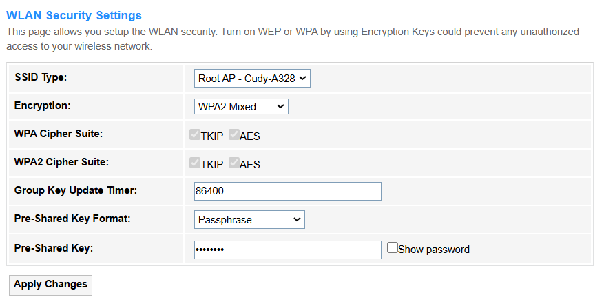

- SSID Type: Shows the Router's network name (SSID) broadcasted. Root AP-Cudy-xxxxxx is the default setting.
- Encryption: Security protocol to scramble data over Wi-Fi.

        - None: No encryption; data is transmitted openly (highly insecure).
        - WEP: Outdated encryption using weak RC4 cipher (easily hacked). Only 11A,11B,11G and 11BG band support it.
        - WPA2: Modern AES-based encryption (secure but vulnerable to KRACK attacks). Keep Authentication Mode/IEEE 802.11w/SHA256/WPA2 Cipher Suite/Group Key Update Timer as default, and configure the Pre-Shared Key Format and Pre-Shared Key as desired.
        - WPA2 Mixed: Supports both WPA2 (AES) and legacy WPA (TKIP) for compatibility. Keep WPA Cipher Suite/WPA2 Cipher Suite/Group Key Update Timer as default, and configure the Pre-Shared Key Format and Pre-Shared Key as desired.
        - WPA3: Latest standard with stronger AES-GCMP and forward secrecy (most secure). Keep H2E/IEEE 802.11w/Cipher Suite/Group Key Update Timer as default, and set up the Pre-Shared Key as desired.
        - WPA3 Transition: Hybrid mode (WPA3 + WPA2) for gradual device upgrades. Keep H2E/IEEE 802.11w/SHA256/Cipher Suite/Group Key Update Timer as default, and set up the Pre-Shared Key as desired.

- Apply Changes: Click to activate all the settings or changes.

### Access Control

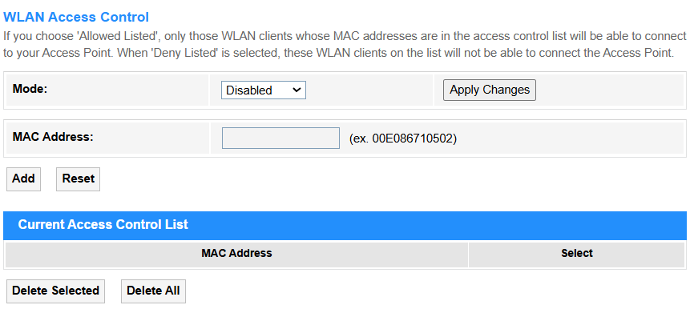

- Mode: Devices are allowed or blocked from connecting to the wireless network.

        - Disabled: Access Control is disabled.
        - Allow Listed: Only the WLAN clients whose MAC addresses are in the Access Control list are allowed to connect to the Access Point.
        - Deny Listed: Only those WLAN clients whose MAC addresses are in the access control list will not be able to connect to your Access Point.

- MAC Address: The unique hardware identifier assigned to a device's network interface (e.g., Wi-Fi or Ethernet) for communication on a local network.
- Apply Changes: Click to activate all the settings or changes.
- Add: Click to add new entries into the Current Access Control List.
- Reset: Click to clear the MAC Address filled in the blank.
- Select: Select the MAC address in the list.
- Delete Selected: Click to delete the selected MAC address in the list.
- Delete All: Click to delete all the MAC address in the list.

### Site Survey

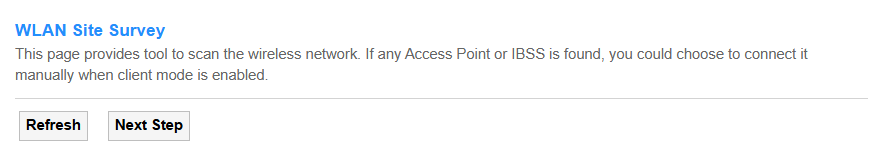

- Refresh: Click to update the list of nearby networks available.

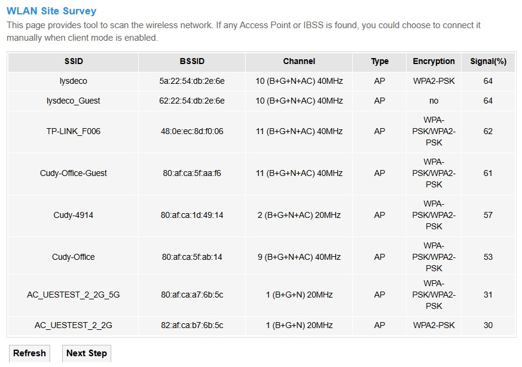

The list will display these network's SSID/BSSID/Wireless Channel opened/Network Type/Encryption/Signal Strength. You may choose to connect the target network manually when client mode is enabled.

---

### WPS

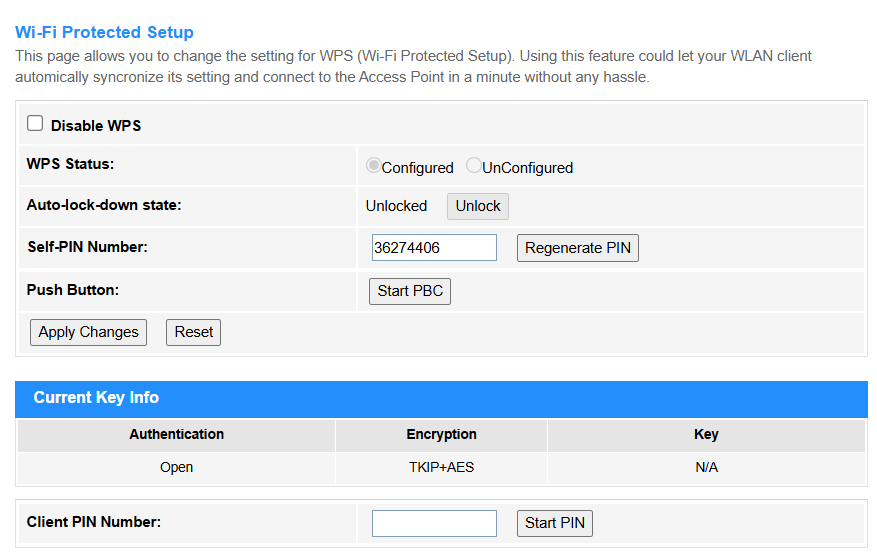

- Disable WPS: WPS is enabled by default. Tick it if you want to disable the WPS function.
- WPS Status: Configured by default.
- Auto-lock-down state: Unlocked by default.
- Self-PIN Number: Displays the current PIN number (an 8-digit numeric code used to securely connect devices to a Wi-Fi network via the Wi-Fi Protected Setup protocol).
- Regenerate PIN: Click to get a new PIN number.
- Reset: Click to retrieve the previous PIN number.
- Apply Changes: Click to activate the settings and changes.
- Push Button: Click this virtual button <i>Start PBC</i> to quickly and easily start the WPS process. Then you have to run WPS in the client(s) within 2 minutes.
- Client PIN number: Enter the client's PIN number and then click <i>Start PIN</i> to connect it to the router's wireless network.
---

### Status

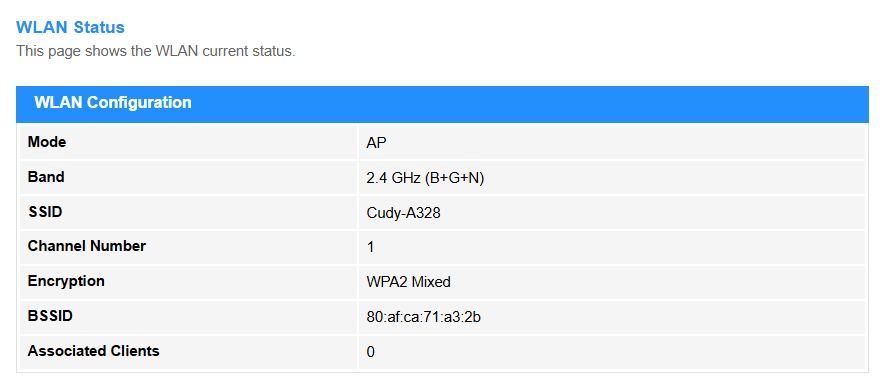

This page will display the current 2.4G WLAN Status, including Mode, Band, SSID, Channel Number, Encryption, BSSID and Associated Clients.

---

## Easy Mesh

### EasyMesh Interface Setup

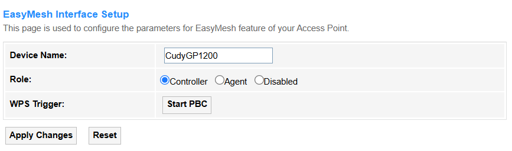

Easy Mesh enables cross-brand router connections, and configured via unified settings like auto-channel selection and WPA3 encryption.

- Device Name: Customize a name for this device.
- Role: Select the working role for this device.

        - Controller: Be the central router to manage the entire Easy Mesh network (e.g., traffic routing, settings sync).
        - Agent: Be a satellite node to extend coverage by relaying signals under the Controller's command.
        - Disabled: Disable the Easy Mesh function.

- WPS Trigger: Click <i>Start PBC</i> to easily and quickly start the WPS process and connect with the agent(s)/client(s).
- Apply Changes: Click to implement the settings or changes.
- Reset: Click to reset this device to disable the Easy Mesh function.

### Topology

- Refresh: Click to update the EasyMesh Network Topology.
