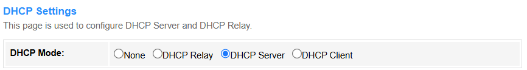
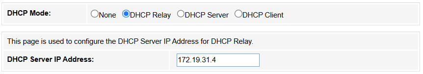
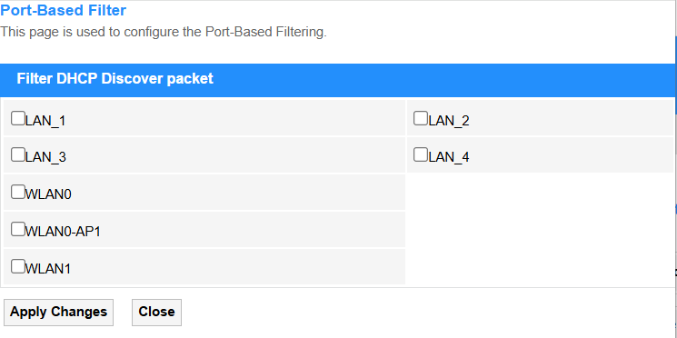
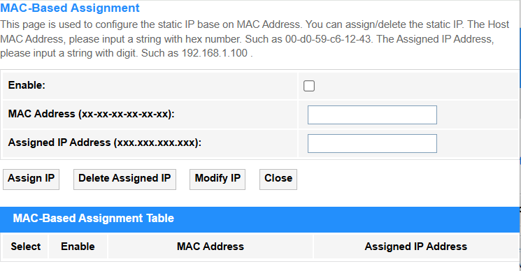
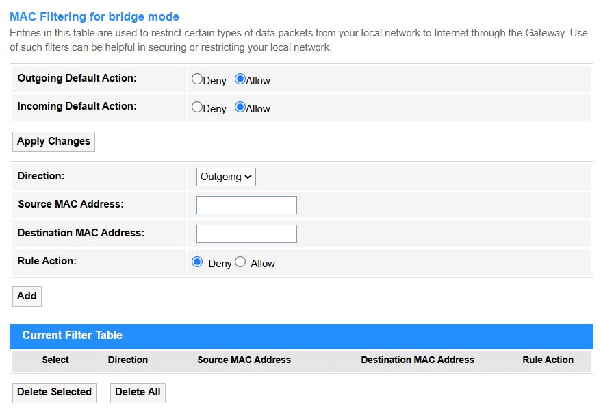
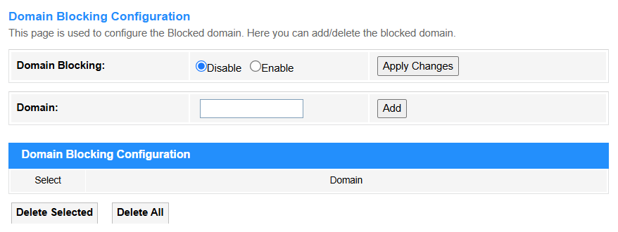
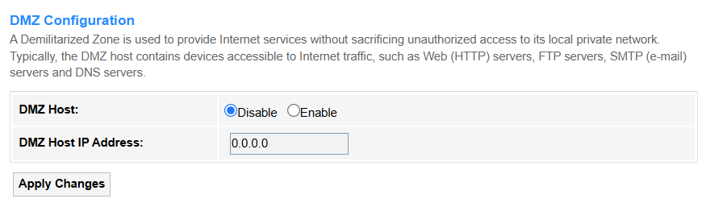

# Services

## Service

### DHCP

**• DHCP Mode:**

**1. None:** DHCP is disabled completely and manual IP configuration is required.
    
**2. DHCP Relay:** The router forwards DHCP requests across subnets/VLANs (enterprise use, e.g., centralizing DHCP in a data center). Enter the DHCP Server IP address, or keep it default.

    
**3. DHCP Server:** The router assigns IP addresses to clients (default for home networks, manages IP pools/leases).

**• LAN IP Address:** Displays the router's IP address.

**• Subnet Mask:** Displays the router's subnet mask.

**• IP Pool Range:** Defines assignable IP addresses (e.g., 192.168.1.100-200).

**• Subnet Mask:** Determines network segmentation (e.g., 255.255.255.0 for /24).

**• Max Lease Time:** Sets duration (seconds) before IP renewal (e.g., 86400 = 1 day).

**• Domain Name:** Specifies local domain suffix (e.g., home.lan).

**• Gateway Address:** Default route for client traffic (e.g., router IP 192.168.1.1).

**• DNS Option:**

    - Use DNS Proxy: The router acts as a middleman, caching and forwarding DNS requests (e.g., for parental controls or ad-blocking).
    - Set Manually: Directly specifies custom DNS servers (e.g., 1.1.1.1 or 8.8.8.8), bypassing ISP defaults.
    - From Default Route WAN: Automatically uses the DNS servers provided by your ISP via the WAN connection.

**• Port-Based Filter:** Blocks/allows DHCP requests based on the Ethernet port numbers (L2 physical interface), ideal for securing specific network jacks in offices or labs.

**• MAC-Based Filter:** Whitelists/blacklists devices by their unique MAC addresses (L2 hardware ID), commonly used for IoT device management or guest network control.

**4. DHCP Client:** An upstream DHCP server (common in ISP modem-router setups) assigns an IP address to the router(client).

---
### Dynamic DNS

**Dynamic DNS (DDNS)** supports automatically updating a domain name with your router's changing public IP address, allowing stable remote access (e.g., for home servers or cameras).

**• Enable:** Tick to activate automatic IP updates for your dynamic domain (essential for remote access with changing ISP IPs).

**• DDNS Provider:** Selects the DNS service.

**① DynDNS.org:** Pioneer DDNS service offering both free (legacy) and enterprise solutions with enhanced security.

- Username: Enter your registered DynDNS account email.

- Password: Enter a DynDNS API Token (generate via dyn.com) — legacy passwords no longer work.

**② TZO:** Business-oriented provider featuring real-time IP updates and integrated email/SMS alerts.     

- Email: Enter your TZO-registered email address.

- Key: Input your unique TZO Authentication Key (found in your TZO account dashboard).

**③ No-IP:** User-friendly free tier (21-day renewal) with port forwarding tools, ideal for home labs.    

- Username: Enter your registered No-IP account email.

- Password: Use your No-IP account password (same as website login).

**• Hostname:** Enter your custom domain (e.g., yourname.ddns.net) that will point to the router's current public IP.

**• Interface:** Specifies which WAN connection (e.g., PPPoE, 4G/5G) to monitor for IP changes.

• Add: Click to add the new entry into the Dynamic DNS Table.

• Modify: Click to modify the selected entry in the Dynamic DNS Table.

• Remove: Click to delete the selected entry in the Dynamic DNS Table.

• Update: Click to update the Dynamic DNS Table.

---

### IGMP Proxy

**• IGMP Robust Count:** Defines how many consecutive missed queries trigger a group timeout (typically 2-5). Higher values improve stability in lossy networks.

**• Last Member Query Count:** Number of last-member queries sent before concluding no members remain (default=2). Reduces premature group deletion.

**• Query Interval:** Time (seconds) between general membership queries (default=125). Shorter intervals detect leaves faster but increase traffic.

**• Query Response Interval:** Max time members have to reply to a query (default=10s). Must be less than Query Interval to avoid collisions.

**• Group Leave Delay:** Grace period before pruning a group after last leave message. Prevents video glitches during channel switches.

• Apply Changes: Click to save and activate the settings or changes.

---

### UPnP

**UPnP (Universal Plug and Play)** supports automatically opening and managing router ports for devices/apps that request external access (e.g., gaming consoles or VoIP), eliminating manual port forwarding.

**• UPnP:** Select Disable to block automatic port requests (recommended for security), or Enable to allow devices to dynamically open ports (convenient for gaming/P2P).

**• WAN Interface:** Selects which internet connection (e.g., PPPoE, 5G) UPnP applies to.

**• Comment:** Make some notes to label rules (e.g., "Xbox NAT Open") for the entry.

**• Local IP:** Enter the internal device's IP (e.g., 192.168.1.100) receiving forwarded traffic.

**• Protocol:** Select TCP, UDP, or both for traffic type (e.g., TCP for web browsing, UDP for VoIP).

**• Local Port:** Enter the Device's service port (e.g., 3074 for Xbox Live).

**• Remote Port:** Enter External port triggering forwarding (often same as Local Port).

**• Security Tip:** Enable UPnP only for trusted devices with static IPs.

• Apply Changes: Click to save and activate the settings or changes.

• Refresh: Click to update the UPnP Current Port Forwarding Table.

---

### RIP

**• Routing Protocol:** Select to enable RIP for path selection.

**• Interface:** Specifies which network ports participate in RIP updates (e.g., eth0/WAN).

**• Receive Mode:** Select to decide how RIP updates are processed (None/RIP1/RIP2/Both).

**• Send Mode:** Select to define RIP version for outgoing updates (None/RIP1/RIP2/RIP1COMPAT).

• Add: Click to add entries into the RIP Config Table.

• Select: Tick to select entries to delete.

• Delete Selected: Delete the selected entries in the table.

• Delete All: Delete all the entries in the table.

---

## Firewall

### IP/Port Filtering

**• Outgoing Default Action:** Firewall allows or denies the traffic from LAN to WAN (typically Allow for user convenience).

**• Incoming Default Action:** Firewall allows or denies the unsolicited traffic from WAN to LAN (usually Deny for security, blocking hackers/scanning).

• Apply Changes: Click to save and activate the settings or changes.

**• Direction:**
            
    - Outgoing: Controls traffic from LAN to WAN (e.g., blocking social media).
    - Incoming: Manages WAN-to-LAN traffic (e.g., allowing SSH access).

**• Protocol:** Select TCP (web/email), UDP (video/VoIP), ICMP (ping), or All for any protocol.

**• Rule Action:** Select Allow to permit traffic or Deny to block or send error.

**• Source/Destination IP address:** The target device’s IP (e.g., 192.168.1.100 for a local server).

**• Subnet Mask:** Defines the network scope (e.g., /24 = 255.255.255.0 for a local subnet).

**• Port:** The service’s port number (e.g., 80 for HTTP, 443 for HTTPS).

• Add: Click to add the entry into the Current Filter Table.

• Select: Tick to select entries to delete.

• Delete Selected: Delete the selected entries in the table.

• Delete All: Delete all the entries in the table.

---

### MAC Filtering

**MAC Filtering for bridge mode** allows or blocks specific devices (identified by their MAC addresses) from accessing the network when the router operates in bridge mode, acting as a transparent pass-through while maintaining MAC-based access control.

**• Outgoing Default Action:** Select to Allow or Deny the default behavior for outgoing traffic when no MAC filter rules match.

**• Incoming Default Action:** Select to Allow or Deny the default behavior for incoming traffic if no rules apply (e.g., Allow for trusted networks).

• Apply Changes: Click to save and activate the settings or changes.

**• Direction:** Select to the direction for traffic flow, either Incoming for LAN→devices or Outgoing for devices→WAN.

**• Source/Destination MAC Address:** Enter the sender’s (Source) or receiver’s (Destination) hardware address for the filtered traffic.

**• Rule Action:** Select to Deny or Allow the traffic matching the rule.

• Add: Click to add the MAC filtering rule configured above into the Current Filter Table.

• Delete Selected: Delete the selected entries in the table.

• Delete All: Delete all the entries in the table.

---

### Port Forwarding

**Port Forwarding** redirects external traffic from specific ports to an internal device (e.g., for gaming servers or remote access). It requires static IP/DHCP reservation for stable operation.

**• Port Forwarding:** Select to Enable the Port Forwarding configuration.

**• Application:** Select the predefined profiles (e.g., "Web Server" or "Xbox Live") that auto-fill common port ranges.

**• Comment:** Make some notes to label rules (e.g., "Security Cam Feed").

**• Local IP:** Enter the internal device’s IP address receiving forwarded traffic (e.g., 192.168.1.100).

**• Local Port from/to:** Enter the port range on the internal device (e.g., 80-80 for HTTP).

**• Protocol:** Select TCP, UDP, or both for traffic type (e.g., TCP for web browsing).

**• Remote IP:** Enter the external source IP address(es) allowed to trigger port forwarding (e.g., only traffic from 203.0.113.5 can access). Leave blank to allow all public IPs.

**• Remote Port from/to:** The external port range triggering forwarding (e.g., 8080-8080 for alternate HTTP access).

**• Interface:** Selects which network connection the port forwarding rule should apply to, ensuring traffic is routed through the correct external link.

• Apply Changes: Click to save and activate the settings or changes.

• Add: Click to add the Port Forwarding rule configured above into the Current Port Forwarding Table.

• Delete Selected: Delete the selected entries in the table.

• Delete All: Delete all the entries in the table.

---

### URL Blocking

**URL Blocking** blocks access to specific web addresses (e.g., socialmedia.com), often used for parental controls. It works at the application layer but may struggle with HTTPS traffic.

**• FQDN (Fully Qualified Domain Name):** Enter the domain to be blocked access to complete web addresses (e.g., www.example.com), including all subdomains and paths under the domain. (Effective for both HTTP/HTTPS when DNS-based filtering is enabled.)

**• Keyword:** Enter the specific text patterns (e.g., "social" or "gamble") in URLs or page content to be blocked (Limited to plain HTTP traffic unless SSL inspection is configured.)

• Apply Changes: Click to save and activate the settings or changes.

• Add: Click to add the URL blocking rule configured above into the URL Blocking Table or Keyword Filtering Table.

• Delete Selected: Delete the selected entries in the table.

• Delete All: Delete all the entries in the table.

---

### Domain Blocking

**Domain Blocking** prevents access to entire domains and subdomains via DNS filtering. More comprehensive than URL blocking and covers HTTPS sites.

**• Domain:** Enter the exact website domain name (e.g., example.com) to be blocked, preventing access to all its subpages and services under that domain.

• Apply Changes: Click to save and activate the settings or changes.

• Add: Click to add the newly-configured Domain blocking rule into the Domain blocking Table.

• Delete Selected: Delete the selected entries in the table.

• Delete All: Delete all the entries in the table.

---

### DMZ

**DMZ (Demilitarized Zone)** exposes one internal device directly to the internet, bypassing firewall protections.

**• DMZ Host:** Select Disable to apply normal firewall protection to all devices (recommended for security); or Enable to bypass firewall completely for one specified device, and it is in high risk, used only for testing/isolated devices.

**• DMZ Host IP Address:** Enter the internal device's IP (e.g., 192.168.1.100) that will be fully exposed to the internet when DMZ is enabled.

• Apply Changes: Click to save and activate the settings or changes.

---