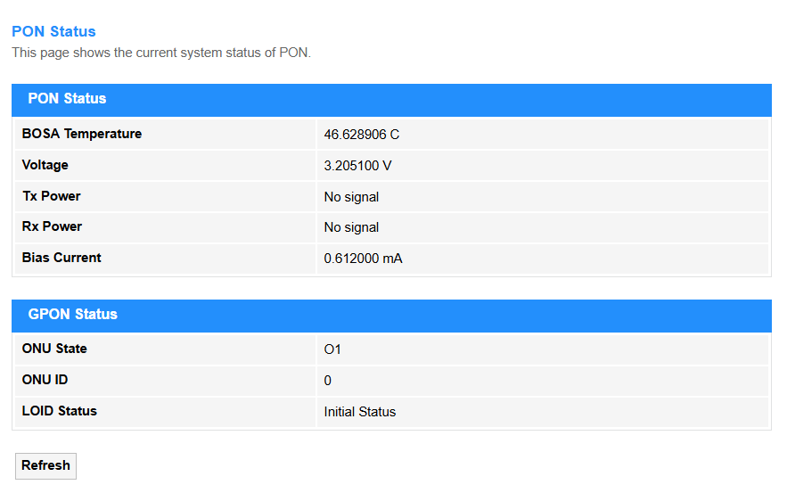
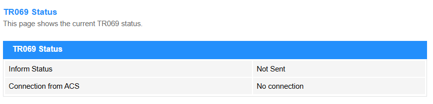

# Status

## Device

**System**

- Device Name: Identifier for the Router.

- Uptime: Time duration since last reboot.

- Firmware Version: Currently installed Router OS version.

- CPU Usage: Current processor load percentage.

- Memory Usage: RAM utilization percentage

- Name Servers: Name of the DNS servers.

- IPv4/IPv6 Default Gateway: Primary route to external networks.

**LAN Configuration**

- IP Address: Router's local network IP.

- Subnet Mask: Network segment definition.

- DHCP Server: Status of automatic IP assignment.

- MAC Address: Physical hardware ID of LAN port.

**WAN Configuration**

- Interface: Physical port.

- VLAN ID: Virtual network tag (if applicable).

- Connection Type: Physical medium (e.g., Fiber/DSL).

- Protocol: Internet protocol (e.g., PPPoE, DHCP, Static).

- IP Address: Public/WAN-facing IP.

- Gateway: ISP-provided gateway IP.

- Status: Connection state (Connected/Disconnected).

----
## IPv6

**LAN Configuration**

- IPv6 Address: Global unicast address assigned to the router's LAN interface (e.g., 2001:db8::1/64). Requires ISP IPv6 deployment and local network support.

- IPv6 Link-Local Address: Automatically generated address (fe80::/10) for local network communication, even without global IPv6 connectivity.

**Prefix Delegation**

- Prefix: IPv6 network segment (e.g., 2001:db8:1::/48) delegated by ISP to the router for subnet allocation. Critical for enterprise networks with multiple VLANs.

**WAN Configuration**

- Interface: Physical WAN port (e.g., eth0, ppp0) or logical tunnel interface.

- VLAN ID: ISP-specific tag (e.g.,100 for internet, 200 for VoIP) to separate services.

- Connection Type: Physical medium: Fiber, DSL, Cable, or 5G Backhaul.

- Protocol: PPPoE (requires credentials), DHCP (auto), Static IP (manual config).

- IP Address: Public/WAN-facing address (IPv4/IPv6) provided by ISP.

- Gateway: ISP's upstream router IP (next hop for internet traffic).

- Status: Connected/Disconnected + uptime counter.

**Route Configuration**

- Destination IP: Target network (e.g., 192.168.2.0/24 for a branch office).

- Source: Originating traffic filter (optional, e.g., LAN or VPN).

- Gateway: Next-hop IP for the route (e.g., 10.0.0.1 for a VPN tunnel).

- Metric: Priority value (lower = preferred); 10 for primary WAN, 20 for failover.

- Interface: Egress port (e.g., ppp0 for DSL, tun0 for VPN).

**DS-Lite Configuration**

- AFTR name: ISP's Address Family Transition Router hostname (e.g., aftr.isp.com).

- AFTR address: IPv6 address of the ISP's transition gateway (e.g., 2001:db8:ffff::1).

- DS-Lite DHCPv6 option: Enables automatic DS-Lite tunnel configuration (IANA option 64).

    *Refresh:* Click to update the <em>IPv6 Status</em>.

----
## PON

**PON Status**

- BOSA Temperature: Operating temperature of the optical transceiver (-40°C to +85°C). Critical Threshold: >75°C may degrade performance.

- Voltage: Power supply voltage (typically 3.3V ±0.3V). Fault Condition: <2.8V or >3.8V indicates power issues.

- Tx Power: Optical signal strength sent to OLT (typical: +1.5dBm to +5dBm). Failure Sign: <-8dBm (fiber break/connector issue).

- Rx Power: Incoming optical signal strength (optimal: -8dBm to -28dBm). Critical Range: >-8dBm (overload) / <-30dBm (signal loss).

- Bias Current: Laser driver current (20mA–50mA for DFB lasers). Risk: >60mA shortens laser lifespan.

**GPON Status**

- ONU State: Operational status: Operation (normal), LOS (signal loss), Dying-Gasp (power failure).

- ONU ID: Unique identifier (0–255) assigned by OLT. Conflicts may require reset.

- LOID Status: Authentication state: Authenticated (success) / Auth-Fail (invalid credentials).

    *Refresh:* Click to update the <em>PON Status</em>.

---
## LAN Port

**LAN Port Status**

- LAN1/2/3/4: Displays the Port status including connection or disconnection, data speed, Mode.

    *Refresh:* Click to update the LAN Port Status.

---
## TR069

**TR069 Status**

- Device Name:  Identifier for the Router.

- Inform Status:  Sent/Not Sent TR-069 notification by the router to the ACS (Auto Configuration Server), including events like boot-up, periodic updates, or parameter changes.

- Connection from ACS:  Current link state with the ISP's remote management server, Connection or No Connection.