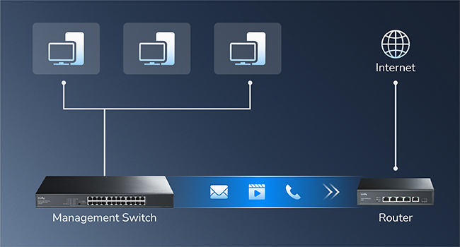
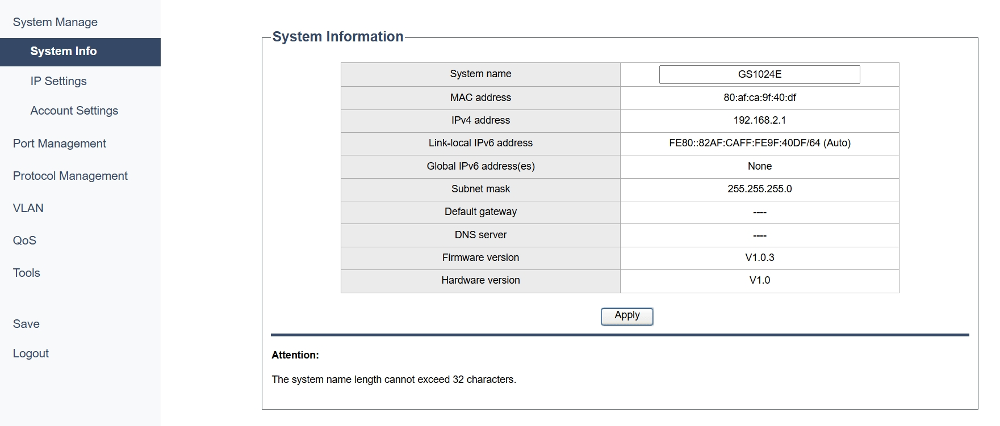

<a href="GS1024E_User Guide.pdf" download>Download User Guide for GS1024E </a>

---
## Overview
<!DOCTYPE html>
<html lang="en">
<head>
    <meta charset="UTF-8">
    <meta name="viewport" content="width=device-width, initial-scale=1.0">
    <title>Tab切换示例</title>
    
</head>

<body>
    <!-- 标签容器 -->
    

        
Package Content

        
Appearance

        
Topology

        
LED & DIP

        
Specification
        
    

    <!-- 内容面板容器 -->
    

        

            

        

        

            

            
&nbsp;
 
            
&nbsp;

            
&nbsp;

            

        

        

            

            
&nbsp;
 
            

        

        

            <table>
                <tr>
                    <th>LED / DIP</th>
                    <th>Description</th>
                </tr>
                <tr>
                    <td>ON/OFF Button</td>
                    <td>Press to turn on/off the PON Router.</td>
                </tr>
                <tr>
                    <td>Power Jack</td>
                    <td>Plug the provided power adapter to supply power.</td>
                </tr>
                <tr>
                    <td>LAN1/2/3 Port</td>
                    <td>Connect to an Ethernet device.</td>
                </tr>
                <tr>
                    <td>LAN4/WAN Port</td>
                    <td>Connect to an Ethernet device or Internet. </td>
                </tr>
                <tr>
                    <td>WPS Button</td>
                    <td>Press for 1 second to authorize WPS connection.</td>
                </tr>
                <tr>
                    <td>WLAN Button</td>
                    <td>Press for 2 seconds to turn on/off Wi-Fi.</td>
                </tr>
                <tr>
                    <td>RESET Button</td>
                    <td>Press for 5 seconds to restore factory defaults.</td>
                </tr>
                <tr>
                    <td>PON Port</td>
                    <td>Connect to the Internet with an optical fiber.</td>
                </tr>
            </table>
        

        

            <table>
                <tr>
                    <th>Model</th>
                    <th>GS1024E</th>
                </tr>
                <tr>
                    <td>Protocol</td>
                    <td>
                    <li>802.3x Flow Control; 802.3i 10BASE-T; 802.3u 100BASE-T; 
                    802.3ab 1000BASE-T; 802.3az Power Saving</li>
                    <li>802.1d:STP; 802.1w:RSTP; 802.1p:LAN Layer 2 QoS/CoS; 
                    802.1q:VLAN Bridge Operation; 802.1ab:LLDP/LLDP-MED</li>
                    </td>
                </tr>
                <tr>
                    <td>Network Media (Cable)</td>
                    <td>
                    <li>Cat. 3 or higher cable: 100 meters at 10 Mbps</li>
                    <li>Cat. 5 or higher cable: 100 meters at 100 Mbps</li>
                    <li>Cat. 5e or higher cable: 100 meters at Gigabit</li>
                    <li>Cat. 5e or higher cable: 250 meters at 10 Mbps</li>
                    <li>Cat. 6 or higher cable: 150 meters at Gigabit</li>
                    </td>
                </tr>
                <tr>
                    <td>Power</td>
                    <td>
                    <li>Input: AC 90~260V 50/60Hz</li>
                    <li>Max Power Consumption: 11W</li>
                    <li>Idle Power Consumption: 6.8W</li>
                    </td>
                </tr>
                <tr>
                    <td>Performance</td>
                    <td>
                    <li>MAC Address Table: 8192</li>
                    <li>Max Switching Capacity: 48 Gbps</li>
                    <li>Max Forwarding Rate: 35.712 Mpps</li>
                    <li>Jumbo Frame: 15KB</li>
                    <li>Packet Buffer: 4 Mbit</li>
                    </td>
                </tr>
                <tr>
                    <td>Dimension</td>
                    <td>440 × 180 × 44 mm (17.32 × 7.09 × 1.73 inches)</td>
                </tr>
                <tr>
                    <td>Installation</td>
                    <td>
                    <li>Desktop</li>
                    <li><a href="https://www.cudy.com/qr_rack_mount_sw_install">Rackmount via Bracket</a></li>
                    </td>
                </tr>
                <tr>
                    <td>Environment</td>
                    <td>
                    <li>Operating Temperature: 0 ℃ ~ 40 ℃ (32 ℉ ~104 ℉)</li>
                    <li>Storage Temperature: -40 ℃ ~ 70 ℃ (-40 ℉ ~ 158 ℉)</li>
                    <li>Operating Humidity: 10% ~ 90% non-condensing</li>
                    <li>Storage Humidity: 5% ~ 90% non-condensing</li>
                    </td>
                </tr>
                <tr>
                    <td>More Data</td>
                    <td> <a href="https://www.cudy.com/pages/download-center/gs1024e-1-0">Download a comprehensive Datasheet</a> </td>
                </tr>
            </table>
        
        
    

    
</body>
</html>

---
## Installation 

The switch supports two means of installation: Desktop and Rackmount via brackets.

<a href="https://www.cudy.com/qr_rack_mount_sw_install"> For more guidance about Rackmount, please refer to >>> >>> </a>

---

---

## Management
### - [System Manage](status.md)

**System Info**

**IP Settings**

**Account Settings**

[For more detailed System Status Descriptions >>> ](status.md)

---
### - General Settings

#### [WAN Mode](wan.md)
is to set your Internet connection. Select your [Internet connection type](wan.md) from the drop-down list of Protocol. Follow the [instructions](wan.md) on the page to complete the [configuration](wan.md). [ >>> >>> ](wan.md)

#### [Wireless](wireless.md)
is to customize the Router’s [wireless settings](wireless.md), including SSID and password, mode, channel, channel width and transmit power,  [and so on](wireless.md). [>>> >>>](wireless.md)

#### [VPN](vpn.md)
namely, [Virtual Private Network](vpn.md), helps you access Internet resources remotely, securely, and privately through tunneling technology. When you access the Internet, VPN encrypts your personal information and hides your IP address from the public. For VPN users, it looks like the devices are directly connected.  [>>> >>>](vpn.md)

Cudy Router supports 6 types of VPN connections: PPTP, L2TP, OpenVPN, WireGuard, ZeroTier, and IPSec (site-to-site). Choose one according to your needs and circumstances, and [set up the VPN Server and Clients](vpn.md). 

#### [Captive Portal](captive_portal.md)
allows you to design a [portal](captive_portal.md) page for network access verification. Customers are directed to view an advertisement or accept set terms before being granted Internet access. In this way, it offers unique marketing opportunities for small businesses to improve brand awareness and deliver marketing messages.  [>>> >>>](captive_portal.md)

Cudy Router comes embedded with six [captive portal](captive_portal.md) providers (HotspotSystem, Iron Wi-Fi, WorldSpot.net, ObiFi, VulaCoin, WiFiMAX) and the setup process is quite simple. After creating an account with the listed providers, users can input the configuration value to enable the [captive portal](captive_portal.md).

#### [Firmware](firmware.md)
Router’s latest [firmware](firmware.md) will be released at the Cudy official website <a href="http://www.cudy.com">www.cudy.com</a>, and you can download it from the download page <a href="http://www.cudy.com/download">www.cudy.com/download</a>. Please choose an appropriate update method and follow the instructions. [>>> >>>](firmware.md)

----

### - Advanced Settings

#### [Network](network.md)

- [LAN](network.md#lan): Modify the Router's LAN IP address, when necessary.

- [Guest Network](network.md#guest-network): Create a guest network without disturbing the main netowrk's security and privacy.

- [DHCP Server](network.md#dhcp-server): Specify the IP address for client devices by the Router as a DHCP Server.

- [IPv6](IPv6.md): Set up an IPv6 Connection.

- [IGMP](network.md#igmp):  Manage and optimize multicast traffic for the client devices, like IPTV.

- [IPTV/VLAN](network.md#iptvvlan):  Enjoy IPTV or VoIP service.

- [QoS](network.md#qos): Prioritize connection of specific devices for a certain duration. 

- [Custom DNS](network.md#custom-dns): Customize a DNS server to be resolved through for DNS names.

- [DDNS](network.md#ddns): Map a domain name to the dynamic IP address of a network device.

- [Static Routing](network.md#static-routing): Manually configure routings for data forwarding.

- [Port Forwards](network.md#port-forwards): Set up public services on your local network with higher security.

- [Port Trigger](network.md#port-trigger): Specify a triggering port and its corresponding external ports.

- [DMZ](network.md#dmz): Disable DMZ unless necessary.

- [Online Detection](network.md#online-detection): Ensure your network always online and operational.

- [TTL](network.md#ttl): Set the maximum time for packets to survive in the network.

- [Wake on LAN](network.md#wake-on-lan): Allow a computer to be turned on or awakened by a network message.

- [UPnP](network.md#upnp): Allow applications or host devices to automatically find the front-end NAT device.

#### [Security](security.md)

- [Firewall](security.md#firewall): Monitor and control incoming and outgoing network traffic based on predetermined security rules.

- [MAC Filter](security.md#mac-filter): Prevent unauthorized devices with certain MAC address from accessing the network.

- [IP Filter](security.md#ip-filter): Block or allow traffic to your network or system based on the IP addresses. 

- [Domain Filter](security.md#domain-filter): Control or limit access to specific websites or Internet services by filtering domain name requests. 

- [IP/MAC Binding](security.md#ipmac-binding): Bind network device’s IP address to its MAC address. 

- [WPS](security.md#wps): Set up a security-protected Wi-Fi connection without sharing/entering credentials. 

- [WiFi Schedule](security.md#wifi-schedule): Turn on/off the router’s wireless network automatically at a specific time.

- [ALG](security.md#alg): Inspect and modify application-layer data in network traffic to allow it to pass through firewalls and other security devices more easily.

#### [System](system.md)

- [System Time](system.md#system-time): Configure the Router's system time, necessary for some time-based functions.

- [Firmware](system.md#firmware): Upgrade the firmware to the latest version

- [Backup/Restore](system.md#backuprestore): Backup the configuration file or restore it

- [Administration](system.md#administration): Access and manage the Router from the local or remote devices

- [Admin Account](system.md#admin-account): Change the Router's login password

- [Language](system.md#language): Customize the Router's web management language

- [Timed Reboot](system.md#timed-reboot): Schedule for the Router rebooting

- [Reboot](system.md#reboot): Reboot the Router for the settings or changes to take effect

- [Reset](system.md#reset): Restore the Router to its factory default settings

- [LED Control](system.md#led-control): Control the Router's LED

- [TR069](system.md#tr069): Configure the Router's TR069 (CPE WAN Management)

---

### - [Parental Control](parental_control.md)

It helps to set up unique restrictions on Internet access for each member of your family via Parental Control feature. You can block inappropriate content, set daily limits for the total time spent online and restrict Internet access to certain time of the day, etc. **This feature only works in Wireless Router mode.**

[For more detailed Parental Control configurations >>> ](parental_control.md)

---

### - [Diagnostic Tools](diagnostic_tools.md)

#### [Diagnosis](diagnostic_tools.md#diagnosis)
The diagnosis result will indicate the status of Internet, Wireless, Devices, Services and System. You can click Download to reserve the diagnosis bin file.  [>>> >>>](diagnostic_tools.md#diagnosis)

#### [PING](diagnostic_tools.md#ping)
is used to test the connectivity between the Router and the tested host, and measure the round-trip time.   [>>> >>>](diagnostic_tools.md#ping)

#### [TRACEROUTE](diagnostic_tools.md#traceroute)
is used to test the route (path) your Router has passed to reach the tested host, and measure transit delays of packets across an Internet Protocol network.   [>>> >>>](diagnostic_tools.md#traceroute)

#### [NSLOOKUP](diagnostic_tools.md#nslookup)
is to check if the DNS IP address of the WAN can work normally.   [>>> >>>](diagnostic_tools.md#nslookup)

#### [System Log](diagnostic_tools.md#system-log)
tracks all the Router behaviors. When the Router does not work normally, download the system log and send it to our Technical Support for troubleshooting.   [>>> >>>](diagnostic_tools.md#system-log)

---